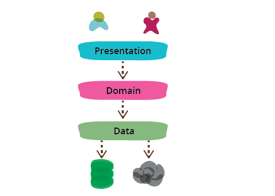
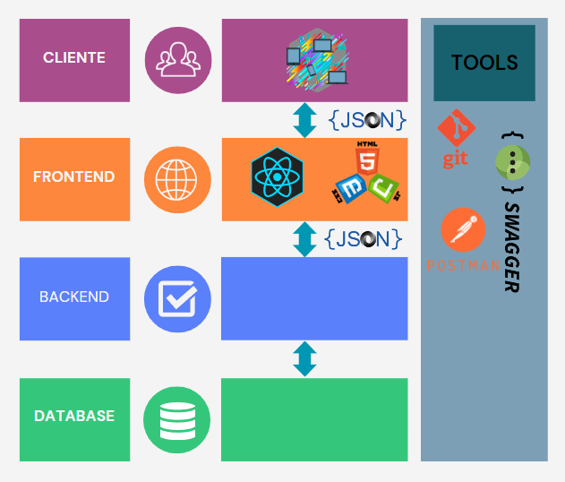
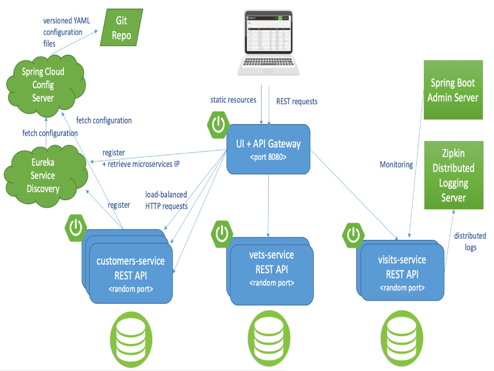
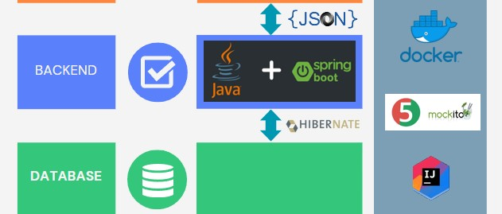

# Apunte de Clase 1

## Introducción

La asignatura de Desarrollo de Backend de Aplicaciones con Java tiene como objetivo proporcionar a los estudiantes una comprensión sólida de los conceptos, técnicas y herramientas utilizadas en el desarrollo del lado del servidor (backend) de aplicaciones utilizando el lenguaje de programación Java. A lo largo de esta asignatura, los estudiantes se familiarizarán con diversos frameworks, patrones de diseño, buenas prácticas y conceptos de seguridad aplicados al desarrollo backend, así como el despliegue y generación de logs para asegurar la eficiencia y la confiabilidad de las aplicaciones.

En la materia desarrollo de software comenzamos a introducirnos en el mundo de la programación de aplicaciones reales y de las alternativas existentes para este propósito revisamos la que propone la construcción del software como un conjunto de capas que interactúan entre sí, y donde cada capa conoce a las adyacentes y se comunica con ellas. Este esquema es ampliamente utilizado en la construcción de aplicaciones reales y sin ser el único es un modelo del mundo real que ya comenzamos a implementar al menos de forma elemental.

Llamamos a estas capas cliente, frontend, backend o database en un modelo simplificado y minimalista y realizamos un estudio e implementación de una versión mínima de cada una de estas capas.

Hagamos un breve repaso de lo visto en Desarrollo de Software sobre capas.

Stack -> Pila:
Pila de capas que se comunican con la anterior y la siguiente

  
> Figura 1: Stack utilizado en Desarrollo de Software

La idea es que cada una de las capas está asociada a una tecnología y que en base a esa tecnología es que construimos la aplicación.

Entonces ese stack es la pila de tecnologías con las que se va a construir la aplicación. Existen varias pilas establecidas y muy utilizadas en la industria como LAMP por ejemplo por Linux + Apache + MySql + Php que se utilizó por mucho tiempo para construir aplicaciones web de código abierto, o MERN por Mongo+Express+React+Node que es bastante más actual y se asemeja en algo a lo que vamos a utilizar.

Siguiendo con el breve repaso, en la materia Desarrollo de Software se utilizó el Stack que se puede observar en la imagen que sigue:

  
> Figura 2: Repaso de frameworks y herrmaientas que intervienen en el frontend
> **Nota:**
> Es evidente que en el gráfico anterior hay una importante cantidad de logos, cada uno de los cuales representa una tecnología que cumple un papel específico en el Stack.  
> Hemos incluido aquí los logos de la mayoría de las tecnologías que vamos a utilizar durante el cursado de la asignatura y por lo tanto iremos adquiriendo mayor profundidad sobre cada una de ellas a medida que avancemos en el cuatrimestre.  
> Sin embargo he eliminado a propósito las tecnologías que vamos a reemplazar en la asignatura Backend de Aplicaciones para no generar dudas.

Donde **Frontend** es la capa donde se programa la interfaz de usuario, **Backend** es la capa donde se programa/orquesta la lógica de negocio, por arriba tenemos a los consumidores de la aplicación, por debajo a la persistencia de los datos, en este caso una base de datos relacional y al costado enumeramos una serie de tecnologías de soporte a la construcción del software pero que no intervienen en el proceso de la ejecución de la aplicación. Describamos brevemente estas capas principales:

**_Cliente_**

El cliente es todo dispositivo que se conecta a nuestro aplicativo, a veces la conexión se produce desde un browser o navegador de internet u otras veces desde aplicativos específicamente desarrollados para proveer la interfaz de usuario, en cualquier caso llamamos cliente al entorno de ejecución de la interfaz de usuario puesto que la capa donde construimos o desarrollamos la interfaz de usuario será la siguiente.

En el caso de nuestra asignatura el cliente queda fuera del alcance ya que en general siempre va a existir otra capa de conexión y el cliente no se conecta directamente al backend. Sin embargo, en el caso de las aplicaciones de dispositivos móviles, por ejemplo, tenemos el cliente fundido con el frontend y ambos se conectan a nuestro backend de forma directa.

**_Frontend_**

El frontend es la capa en donde desarrollaremos tanto la presentación de la información al usuario, y el estilo visual de dicha presentación como la captura de interacción de este con la aplicación y la lógica asociada a que estos procesos de captura y presentación correspondan con los requerimientos planteados para nuestro aplicativo.

Existen muchas alternativas para construir esta capa pero en nuestro caso de esas alternativas hemos elegido construir el front end, usar herramientas para construir aplicaciones que se consumen a través de un navegador de internet, construir aplicaciones de escritorio o construir aplicaciones para dispositivos móviles.

**_Backend_**

El backend es la capa donde se motorizan las reglas del negocio de la aplicación a desarrollar, es decir, es donde se hacen cumplir las reglas que debemos validar sobre las entidades del sistema, además en esta capa debemos asegurar la aplicación involucrando técnicas de control de acceso y debemos optimizar procesos para lograr dar servicio a la mayor cantidad de usuarios con recursos acotados.

En esta asignatura nos vamos a dedicar específicamente a las problemáticas asociadas a la construcción de esta capa y por lo tanto vamos a abordar en detalle su definición en el apartado siguiente.

**_Database_**

En realidad la palabra database hace referencia específicamente a la base de datos pero llamamos a esta capa, capa de datos porque tiene que ver con todo lo que la aplicación requiera persistir, base de datos, archivos, o incluso la interconexión con otros sistemas.

En nuestra asignatura podremos utilizar alguna alternativa externa como puede ser MySql o una alternativa embebida como lo hicimos en Desarrollo de Software con SqLite de todos modos como veremos para Java es indistinto a qué base (siempre que sea relacional) de datos nos estemos conectando.

**_Herramientas_**

Finalmente, en este bloque mencionamos algunas de las herramientas transversales que utilizaremos a lo largo del cuatrimestre para desarrollar nuestra aplicación, como el repositorio de código fuente, herramientas para llevar a cabo pruebas, o el entorno integrado de desarrollo que usaremos para escribir el código y administrar los proyectos.

**_En conclusión_**, hasta aquí hemos revisado algunos conceptos acerca del desarrollo de software en capas y hemos mencionado brevemente las alternativas de especializarnos en una de las capas o aplicarnos a tener un conocimiento sobre todas ellas... en el apartado siguiente intentaremos definir precisamente este último rol.

## La capa de Backend

El backend de aplicaciones es un conjunto de servicios y componentes que trabajan en conjunto para dar soporte a la funcionalidad de la aplicación. Está diseñado para ser una parte robusta y segura de la arquitectura, garantizando que la aplicación sea escalable, fácil de mantener y capaz de manejar grandes volúmenes de tráfico.

El desarrollo de backend presenta varios desafíos y problemáticas, tales como el manejo de la lógica de negocio, la escalabilidad, la seguridad, el rendimiento y la integración con sistemas externos. Estos aspectos son críticos para el éxito de las aplicaciones y requieren habilidades técnicas y metodologías sólidas para ser abordados eficientemente.

Si analizamos brevemente cada uno de estos desafíos o problemáticas tendremos elementos para comprender la complejidad asociada al desarrollo del backend y herramientas para aprovechar en de las herramientas propuestas.

**_Manejo de la lógica de negocio:_**
El desarrollo de backend implica la implementación y gestión de la lógica de negocio de una aplicación, es decir, las reglas y procesos que definen cómo funcionará el sistema y cómo se llevarán a cabo las operaciones.
Análisis: El manejo efectivo de la lógica de negocio es fundamental para que la aplicación cumpla con sus objetivos y funcione correctamente. Requiere una comprensión clara de los requerimientos del negocio y la habilidad para traducirlos en código funcional. Además, es esencial mantener la lógica de negocio organizada, modular y fácil de mantener a medida que la aplicación crece y evoluciona.

**_Escalabilidad:_**
La escalabilidad se refiere a la capacidad del backend para manejar un aumento en la carga de trabajo o el número de usuarios sin degradar el rendimiento o la disponibilidad del sistema.
Análisis: En aplicaciones exitosas, la demanda puede crecer rápidamente, y el backend debe estar preparado para escalar horizontal o verticalmente para satisfacer las necesidades de la audiencia en crecimiento. Es importante diseñar la arquitectura y utilizar tecnologías que permitan la escalabilidad sin sacrificar el rendimiento ni aumentar los costos operativos.

**_Seguridad:_**
La seguridad es un aspecto crítico del desarrollo de backend, ya que implica proteger los datos y recursos del sistema de accesos no autorizados y ataques maliciosos.
Análisis: Un backend seguro es esencial para proteger la información sensible de los usuarios y garantizar la integridad de los datos. Se deben implementar prácticas de seguridad sólidas, como autenticación, autorización, cifrado de datos y validación de entrada, para mitigar posibles vulnerabilidades y reducir el riesgo de brechas de seguridad.

**_Rendimiento:_**
El rendimiento se refiere a la capacidad del backend para responder rápidamente a las solicitudes de los usuarios y proporcionar una experiencia fluida y ágil.
Análisis: Un backend eficiente es crucial para mantener una alta calidad de servicio. Para lograr un buen rendimiento, se deben optimizar consultas a bases de datos, minimizar el uso de recursos y considerar la distribución de la carga de trabajo. También es esencial llevar a cabo pruebas exhaustivas de rendimiento para identificar posibles cuellos de botella y áreas de mejora.

**_Integración con sistemas externos:_**
En muchas aplicaciones, el backend debe integrarse con sistemas externos, como servicios web, API de terceros o sistemas legacy, para proporcionar funcionalidades adicionales o acceder a datos externos.
Análisis: La integración exitosa con sistemas externos puede mejorar significativamente la funcionalidad de la aplicación, pero también puede ser un desafío técnico. Es importante asegurarse de que la integración sea confiable y robusta, considerando aspectos como la compatibilidad de versiones, la tolerancia a fallos y la gestión adecuada de errores.

En resumen, el desarrollo de backend implica enfrentar desafíos complejos y críticos relacionados con estos tópicos y nos proponemos en esta asignatura brindar no solo alternativas para enfrentarlos sino sobre todo la capacidad de discernir entre distintas alternativas comprendiendo sus ventajas y desventajas en cada caso.

### Backend Organización Interna

Para organizar y mantener un código limpio y eficiente, el backend de aplicaciones se divide en módulos y subcapas internas. Cada módulo se enfoca en una funcionalidad específica de la aplicación, y dentro de cada módulo, existen subcapas que ayudan a separar diferentes responsabilidades.

Por ejemplo, un sistema de comercio electrónico puede tener módulos para el manejo de usuarios, gestión de productos, procesamiento de pagos y generación de informes. Cada uno de estos módulos podría estar compuesto por subcapas como controladores (para manejar solicitudes HTTP), servicios (para la lógica de negocio) y repositorios (para interactuar con la base de datos).

### Organización de Componentes en el Interior del Backend

Hay varias alternativas para organizar los componentes dentro del backend de aplicaciones. Algunas de las más comunes son:

**_Arquitectura Monolítica:_** Todos los componentes se encuentran dentro de una única aplicación desplegable. En una arquitectura monolítica, todos los componentes de una aplicación se encuentran dentro de una única unidad. La aplicación es un todo cohesivo, y todos los servicios y funcionalidades están empaquetados juntos. Los componentes pueden comunicarse directamente entre sí, ya que comparten la misma base de código y recursos.
Aunque es simple, puede volverse compleja a medida que la aplicación crece. Si bien existe la división de capas estas coexisten todas en un mismo empaquetado y no tengo forma de realizar un cambio en un componente si redesplegar y modificar toda la aplicación.

**Ventajas:**

- Fácil de desarrollar y probar en un entorno local.
- Menos complejidad en el despliegue y el monitoreo.

**Desafíos:**

- Dificultad para escalar componentes de manera independiente.
- Acoplamiento fuerte entre los módulos, lo que dificulta la evolución y el mantenimiento.

**_Microservicios:_** La arquitectura de Microservicios es un enfoque moderno que divide una aplicación en servicios pequeños, autónomos y especializados. Cada microservicio se enfoca en una única funcionalidad de la aplicación y puede ser desarrollado, desplegado y escalado de forma independiente. Los microservicios se comunican a través de interfaces bien definidas, como APIs HTTP o colas de mensajes. La aplicación se divide en servicios independientes y autónomos, cada uno con su propia base de código y funcionalidad. Esto facilita la escalabilidad y el despliegue.

**Ventajas:**

- Escalabilidad y despliegue independiente de los servicios.
- Facilita el desarrollo ágil y la evolución de componentes por separado.
- Mayor resistencia ante fallos, ya que el fallo en un servicio no afecta a los demás.

**Desafíos:**

- Mayor complejidad en el desarrollo y la gestión debido a la cantidad de servicios.
- Requiere una infraestructura adecuada para el despliegue y la comunicación entre microservicios.
- Pruebas e integración más complejas debido a la arquitectura distribuida.

**_Arquitectura Hexagonal (Ports & Adapters):_** La arquitectura hexagonal se centra en separar la lógica de negocio (dominio) del acceso a datos y la interacción con otros sistemas externos (adaptadores). Los puertos son interfaces que definen cómo se comunica el núcleo de la aplicación con el mundo exterior, y los adaptadores son las implementaciones concretas de esas interfaces. Se centra en separar la lógica de negocio del acceso a datos y la interacción con otros sistemas, lo que mejora la modularidad y la testabilidad.

**Ventajas:**

- Facilita la prueba unitaria y la modificación del núcleo de la aplicación sin afectar los adaptadores externos.
- Permite la fácil adaptación a diferentes entornos (por ejemplo, base de datos, servicios externos).

**Desafíos:**

- Puede requerir una mayor cantidad de código y diseño para establecer las interfaces y los adaptadores.
- No siempre es la mejor opción para aplicaciones pequeñas y sencillas.

**_Arquitectura basada en Servicios (SOA):_** La arquitectura basada en servicios (SOA) se enfoca en construir aplicaciones como un conjunto de servicios independientes que se comunican a través de protocolos estándar como HTTP y XML. Los servicios son componentes autónomos que encapsulan la lógica de negocio y pueden ser implementados en diferentes tecnologías. Los servicios son componentes independientes que se comunican entre sí mediante interfaces bien definidas.

Se diferencia de la Arquitectura de Microservicios en que en la mayoría de los casos se implementa mediante un enfoque monolítico y, dentro de dicha aplicación monolítica, los servicios se vuelven mecanismos de interoperabilidad con otros sistemas o exposición de funcionalidades.

**Ventajas:**

- Favorece la reutilización y la interoperabilidad de servicios.
- Facilita la integración con sistemas externos.

**Desafíos:**

- Puede volverse complejo en aplicaciones grandes debido a la cantidad de servicios.
- Requiere una infraestructura de comunicación y coordinación.

Independientemente del enfoque utilizado, el backend de aplicaciones es un elemento esencial en el desarrollo de sistemas de software modernos. Proporciona la lógica, funcionalidad y acceso a datos necesarios para que las aplicaciones funcionen de manera eficiente y confiable. La correcta organización de los módulos y subcapas internas, así como la elección adecuada de la arquitectura, son cruciales para garantizar un desarrollo eficiente y sostenible.

En esta asignatura, exploraremos diversos tópicos relacionados con el desarrollo de Microservicios en Java, como frameworks, patrones de diseño, buenas prácticas, seguridad, despliegue y generación de logs. Cada uno de estos temas desempeña un papel importante en la construcción de aplicaciones backend de alta calidad.

## Microservicios: Enfoque Detallado

La arquitectura de Microservicios es especialmente adecuada para aplicaciones grandes y complejas donde se requiere una escalabilidad y despliegue independiente de los servicios. Cada microservicio puede ser desarrollado por equipos especializados y desplegado en diferentes máquinas o contenedores.

**_Características de Microservicios:_**

- Independencia: Cada microservicio es una unidad independiente, lo que significa que puede ser desarrollado, probado, desplegado y escalado por separado.

- Comunicación basada en APIs: Los microservicios se comunican entre sí a través de interfaces bien definidas, como APIs RESTful o colas de mensajes.

- Escalabilidad: Los microservicios permiten escalar solo los servicios que necesitan más recursos, lo que mejora el rendimiento y la eficiencia.

- Resiliencia: Si un microservicio falla, no afecta a los demás, lo que mejora la disponibilidad y la resistencia del sistema.

- Flexibilidad Tecnológica: Cada microservicio puede estar implementado con diferentes tecnologías, lo que permite elegir la mejor tecnología para cada funcionalidad.

**_Consideraciones en el Desarrollo de Microservicios:_**

- Gestión de Datos: Cada microservicio puede tener su propia base de datos o compartir bases de datos entre ellos. La elección depende de la cohesión de los datos y la independencia entre los servicios.

- Comunicación: La comunicación entre microservicios es crítica y puede ser gestionada mediante HTTP, mensajería asincrónica o eventos.

- Gestión de Errores y Tolerancia a Fallas: Cada microservicio debe manejar sus errores y ser tolerante a fallas. Se pueden implementar estrategias de reintentos, circuit breakers, y otros patrones de tolerancia a fallas.

- Seguridad: La seguridad es fundamental en un entorno distribuido. Se deben implementar medidas como autenticación y autorización en cada microservicio.

- Monitorización y Logging: Es esencial monitorear el estado de cada microservicio y registrar eventos importantes para la detección de problemas y la resolución de incidencias.

### Microservicios hacia Endpoints

En una arquitectura de microservicios, la aplicación se divide en varios servicios pequeños e independientes, cada uno de los cuales se enfoca en una funcionalidad específica. Cada microservicio es un contenedor autónomo que puede ser desarrollado, desplegado y escalado de forma independiente. La comunicación y la interacción entre estos servicios se realizan a través de endpoints bien definidos, que actúan como puntos de entrada para las solicitudes y respuestas.

#### Microservicio como Contenedor

Un microservicio es una unidad de despliegue que encapsula una parte del negocio o una funcionalidad específica de la aplicación. Cada microservicio contiene todo lo necesario para cumplir su propósito, incluyendo la lógica de negocio, el acceso a datos, las configuraciones y las dependencias. La independencia de los microservicios permite una mayor flexibilidad y escalabilidad, ya que cada uno puede ser modificado, actualizado y desplegado sin afectar a los demás.

Por ejemplo, en una aplicación de comercio electrónico, podríamos tener microservicios separados para la gestión de usuarios, el catálogo de productos, el procesamiento de pagos y la generación de informes. Cada uno de estos microservicios se centra en una funcionalidad específica y opera de manera autónoma.

#### Endpoints como Puntos de Entrada

Los endpoints son los puntos de acceso a los microservicios. Actúan como interfaces que permiten la comunicación entre los microservicios y los clientes (como aplicaciones frontend, otros microservicios o sistemas externos). Cada endpoint expone una o más operaciones que pueden ser invocadas a través de protocolos estándar, como HTTP/HTTPS, utilizando métodos como GET, POST, PUT y DELETE y brindan acceso a un recurso específico del negocio que podemos identificar de manera unívoca por la URI que define al endpoint.

Un endpoint típico en un microservicio podría ser una API REST o RESTful, que define un conjunto de operaciones que se pueden realizar sobre los recursos gestionados por ese microservicio. Por ejemplo, un microservicio de gestión de usuarios podría tener endpoints para crear, leer, actualizar y eliminar usuarios:

- GET /users: Obtener una lista de usuarios.
- GET /users/{id}: Obtener detalles de un usuario específico.
- POST /users: Crear un nuevo usuario.
- PUT o PATCH /users/{id}: Actualizar un usuario existente.
- DELETE /users/{id}: Eliminar un usuario.

### Agrupación de Conceptos en Microservicios

La agrupación de conceptos en microservicios implica definir claramente los límites de cada servicio y las responsabilidades que cada uno debe asumir. Esto se hace con el objetivo de minimizar las dependencias y maximizar la cohesión dentro de cada microservicio. Un microservicio debe encargarse de una única responsabilidad o un conjunto estrechamente relacionado de responsabilidades.

Por ejemplo, en una aplicación de reservas de viajes, podríamos definir los siguientes microservicios:

- Microservicio de Reservas: Maneja la creación, actualización y cancelación de reservas.
- Microservicio de Usuarios: Gestiona la autenticación, autorización y perfil de los usuarios.
- Microservicio de Pagos: Procesa los pagos y gestiona las transacciones financieras.
- Microservicio de Notificaciones: Envía notificaciones por correo electrónico y SMS a los usuarios.

Cada uno de estos microservicios se enfoca en un aspecto específico del negocio, lo que facilita su desarrollo, mantenimiento y escalabilidad.

### Interacción entre Microservicios a través de Endpoints

La interacción entre microservicios se realiza principalmente a través de llamadas a los endpoints expuestos por cada servicio. Esta interacción puede ser sincrónica o asincrónica, dependiendo de los requisitos del sistema y la naturaleza de la comunicación.

- Comunicación Sincrónica: En este modelo, un microservicio realiza una solicitud a otro microservicio y espera una respuesta antes de continuar. Esto se suele implementar mediante APIs RESTful o llamadas HTTP. Por ejemplo, el microservicio de Reservas puede hacer una llamada al microservicio de Pagos para verificar y procesar un pago antes de confirmar una reserva.

- Comunicación Asincrónica: En este modelo, un microservicio envía un mensaje a otro microservicio y no espera una respuesta inmediata. Esto se suele implementar mediante colas de mensajes o sistemas de eventos. Por ejemplo, el microservicio de Reservas puede publicar un evento "ReservaCreada" en una cola de mensajes, y el microservicio de Notificaciones puede suscribirse a este evento para enviar una confirmación al usuario.

La definición clara de los endpoints y la estructura de la comunicación entre microservicios son cruciales para garantizar la coherencia, la fiabilidad y el rendimiento del sistema. Además, es importante implementar prácticas de seguridad, gestión de errores y monitoreo para asegurar que la interacción entre microservicios sea segura y eficiente.

### Estructuras de Endpoints en Microservicios

Como dijimos, en una arquitectura de microservicios, los endpoints son los puntos de entrada para las solicitudes que llegan a los servicios individuales. La correcta definición y estructuración de los endpoints es crucial para asegurar que la comunicación entre los servicios sea clara, eficiente y mantenible.

#### Principios Básicos de los Endpoints

1. Simplicidad y Consistencia: Los endpoints deben ser simples, intuitivos y consistentes a lo largo de toda la aplicación. Esto facilita su uso y mantenimiento.
2. RESTful: Aunque no es obligatorio, es una práctica común estructurar los endpoints siguiendo los principios REST (Representational State Transfer). Esto incluye el uso de HTTP verbs (GET, POST, PUT, DELETE) y la utilización de URIs claras y significativas.
3. Versionado: Es importante versionar los endpoints para manejar cambios y actualizaciones en la API sin interrumpir el servicio para los clientes existentes.

### Conclusión - Ejemplo de aplicación: PetClinic

PetClinic es una aplicación de ejemplo desarrollada inicialmente por Spring como una muestra de cómo construir aplicaciones web robustas y escalables utilizando el framework Spring. A lo largo de los años, PetClinic se ha convertido en un referente en la comunidad de desarrollo de software, siendo un ejemplo ampliamente utilizado para demostrar diversas tecnologías y arquitecturas.

[https://github.com/spring-petclinic/spring-petclinic-microservices](https://github.com/spring-petclinic/spring-petclinic-microservices)

Esta versión deriva de una versión aún anterior llamada PetShop que estaba implementada con tecnologías anteriores a Spring, cuando se migra a Spring se cambia el nombre a PetClinic.

#### Evolución de PetClinic

**1. Aplicación Monolítica:**
    - **Tecnologías**: En sus inicios, PetClinic era una aplicación monolítica construida con Spring Framework, que integraba todas las funcionalidades en una sola aplicación desplegable.
    - **Arquitectura**: La arquitectura estaba basada en capas tradicionales: presentación, negocio y acceso a datos, todas dentro de la misma aplicación.
    - **Desventajas**: Aunque este enfoque era suficiente para pequeñas aplicaciones, no escalaba bien para sistemas más grandes debido a problemas como el acoplamiento entre módulos, dificultades para escalar horizontalmente y la complejidad del despliegue.

**2. Migración a Spring Boot:**
     - **Tecnologías**: Con la popularización de Spring Boot, PetClinic fue migrada para aprovechar las capacidades de auto-configuración, lo que simplificó enormemente el proceso de desarrollo y despliegue.
     - **Arquitectura**: Aunque seguía siendo monolítica, la aplicación se benefició de una configuración más sencilla, integraciones más rápidas con otras tecnologías de Spring, y la posibilidad de empaquetar la aplicación en un solo archivo JAR ejecutable.
     - **Ventajas**: Este enfoque permitió a los desarrolladores experimentar con la potencia de Spring Boot y cómo este facilitaba la creación de aplicaciones Spring de manera más rápida y eficiente.

**3. Arquitectura de Microservicios:**
     - **Tecnologías**: Con el auge de las arquitecturas de microservicios, PetClinic se adaptó nuevamente, fragmentándose en múltiples servicios más pequeños y especializados.
     - **Arquitectura**: La aplicación fue rediseñada para funcionar como una colección de microservicios independientes, cada uno enfocado en una parte del negocio (por ejemplo, gestión de clientes, veterinarios, visitas). Estos servicios se comunican entre sí a través de API REST y son gestionados por un API Gateway.
     - **Ventajas**: Esta arquitectura permite escalar y desplegar servicios de manera independiente, mejorar la resiliencia del sistema, y facilitar la adopción de tecnologías y metodologías modernas como DevOps, CI/CD, y cloud computing.

#### Importancia de PetClinic en la Comunidad

PetClinic no solo ha servido como un ejemplo práctico de cómo utilizar Spring y sus tecnologías asociadas, sino que también ha proporcionado un caso de estudio real para aprender sobre diferentes patrones arquitectónicos y sus implicaciones en el desarrollo de software.

Los desarrolladores pueden utilizar PetClinic para:

- **Aprender Spring Framework**: Explorar cómo implementar patrones comunes como Inyección de Dependencias, AOP, y transacciones.
- **Experimentar con Spring Boot**: Ver cómo la autoconfiguración y las propiedades de Spring Boot simplifican el desarrollo.
- **Entender Microservicios**: Observar cómo una aplicación monolítica puede transformarse en una arquitectura de microservicios, abordando problemas como la escalabilidad y la resiliencia.
- **Aplicar DevOps**: Integrar prácticas de CI/CD y automatización en una aplicación Spring.

PetClinic ha sido actualizado continuamente para reflejar las mejores prácticas y nuevas tecnologías, convirtiéndose en una herramienta educativa invaluable para desarrolladores de todos los niveles.

#### Arquitectura de Microservicios en PetClinic

Esta imagen representa una arquitectura de microservicios basada en Spring Boot, que es un ejemplo común en la aplicación PetClinic. Aquí te explico cada uno de los componentes y cómo se integran en la solución general.

  
> Figura 4: Arquitectura de microservicios de PetClinic

##### Explicación de los componentes

1. **Spring Cloud Config Server**:
   - **Función**: Proporciona la configuración centralizada para todos los microservicios en la arquitectura. Este servidor obtiene los archivos de configuración (generalmente YAML) desde un repositorio Git.
   - **Ventaja**: Permite gestionar la configuración de todos los servicios desde un único lugar, lo que facilita la actualización y mantenimiento.

2. **Eureka Service Discovery**:
   - **Función**: Es un servicio de descubrimiento que permite a los microservicios registrarse y descubrir otros servicios sin necesidad de conocer su ubicación física (IP y puerto).
   - **Ventaja**: Facilita el escalado horizontal de los microservicios y permite que los clientes encuentren automáticamente las instancias disponibles de los servicios.

3. **API Gateway**:
   - **Función**: Este componente actúa como un punto de entrada para las peticiones REST y redirige las solicitudes a los microservicios correspondientes. También puede servir contenido estático.
   - **Ventaja**: Ofrece una capa central para la autenticación, autorización, y el balanceo de carga de las solicitudes hacia los microservicios.

4. **Microservicios (customers-service, vets-service, visits-service)**:
   - **Función**: Cada uno de estos servicios representa una funcionalidad específica del sistema (gestión de clientes, veterinarios, visitas) y se ejecuta en un puerto aleatorio.
   - **Ventaja**: Desacopla la funcionalidad en servicios independientes, lo que permite escalarlos y mantenerlos de manera individual.

5. **Spring Boot Admin Server**:
   - **Función**: Permite monitorear el estado de todos los microservicios registrados en el sistema, proporcionando una interfaz central para revisar logs, métricas, y estado general de las aplicaciones.
   - **Ventaja**: Facilita la administración y monitoreo de los servicios en un solo lugar.

6. **Zipkin Distributed Logging Server**:
   - **Función**: Es un servidor de trazas distribuido que recopila y muestra logs distribuidos a través de los microservicios. Ayuda a rastrear y analizar el flujo de solicitudes entre servicios. Utiliza plataformas como Prometheus y Graphana para organización y visualización de los logs de forma centralizada.
   - **Ventaja**: Es esencial para la observabilidad en arquitecturas de microservicios, ayudando a identificar problemas de rendimiento y depurar errores.

#### En Resumen

Esta arquitectura representa una implementación sólida de microservicios utilizando el ecosistema de Spring. Cada servicio es independiente, lo que facilita su mantenimiento, despliegue, y escalabilidad. Los componentes como Eureka, Spring Cloud Config, y el API Gateway proporcionan una infraestructura robusta para la gestión y operación de los microservicios, mientras que Spring Boot Admin y Zipkin ofrecen herramientas esenciales para la administración y monitoreo. En conjunto, esta arquitectura muestra cómo dividir una aplicación monolítica en componentes más pequeños y manejables, mejorando la resiliencia y la capacidad de respuesta de la aplicación en un entorno de producción. 

Si bien algunos de estos componentes no los vamos a utilizar en la asignatura la idea en este primer material es dar un pantallazo general para luego ir identificando cada componente asociado a las técnicas y herramientas para su implementación.

## Tecnologías a utilizar en el desarrollo de Backend

Para soportar el conjunto de componentes y configuraciones que se requieren para implementar el backend con Microservicios en base a todo lo que hemos venido debatiendo incluye las que aquí mencionamos como principales intervinientes.

En la siguiente imagen retomamos el modelo de capas con foco en el backend para ubicar allí dichas tecnologías y herramientas:

  
> Figura 3: Tecnologías que vamos a utilizar en Backend de Aplicaciones
> **Nota:**  
> He agregado las principales tecnologías que vamos a utilizar y no agregué los logos de todas para que no quede una ensalada de imágenes.  
> Sin embargo, a continuación describo brevemente cada una de las principales tecnologías del Stack.

### Lenguajes, Frameworks y Librerías

**_Java:_**
Java es un lenguaje de programación orientado a objetos, ampliamente utilizado en el desarrollo de aplicaciones empresariales. Es conocido por su portabilidad, facilidad de uso y robustez.

   > **_JDBC (Java Database Connectivity):_**  
   > JDBC es una API de Java que permite la interacción con bases de datos relacionales. Permite a las aplicaciones realizar consultas, actualizaciones y operaciones en la base de datos utilizando SQL.
   >
   > **_JPA (Jakarta Persistence API):_**  
   > JPA es una especificación estándar para el mapeo objeto-relacional (ORM) en Java. Permite definir cómo los objetos de la aplicación se relacionan con tablas de bases de datos mediante anotaciones, y proporciona una abstracción sobre el acceso y manipulación de datos. JPA no es una implementación, sino una interfaz común que puede ser implementada por frameworks como Hibernate, EclipseLink, u OpenJPA.

**_Spring Framework:_**
Spring Framework es un framework de desarrollo de aplicaciones Java que proporciona una infraestructura completa para crear aplicaciones empresariales. Incluye módulos para inyección de dependencias, acceso a datos, seguridad, transacciones y más.

   > **_Spring Boot:_**
   > Spring Boot es un proyecto de Spring que facilita la creación de aplicaciones Spring autónomas y listas para producirse. Proporciona una configuración predeterminada y simplificada, lo que permite enfocarse en el desarrollo de características.
   >
   > **_Spring Data:_**
   > Spring Data es un módulo de Spring que facilita el acceso y la manipulación de datos en la aplicación mediante una abstracción de acceso a datos. Proporciona una forma unificada de trabajar con diferentes fuentes de datos, como bases de datos SQL y NoSQL.
   >
   > **_Spring Gateway:_**
   > Spring Gateway, también conocido como Spring Cloud Gateway, es un proyecto de Spring Cloud que proporciona un enrutador/API Gateway para aplicaciones basadas en microservicios. Facilita el enrutamiento y filtrado de peticiones entre servicios.
   >
   > **_Spring Security:_**
   > Spring Security es un módulo de Spring que se ocupa de la seguridad en aplicaciones. Proporciona autenticación, autorización, protección contra ataques y otras características de seguridad para proteger la aplicación y los datos.

**_Hibernate:_**
Hibernate es un framework de mapeo objeto-relacional (ORM) que facilita la interacción con bases de datos relacionales a través de objetos Java. Abstrae la capa de acceso a datos, lo que permite trabajar con objetos en lugar de SQL.

**_JUnit:_**
JUnit es un framework de pruebas unitarias para Java. Permite escribir pruebas automatizadas para verificar el comportamiento correcto de las clases y métodos de la aplicación.

**_Mockito:_**
Mockito es un framework de pruebas en Java que permite crear objetos simulados (mocks) para facilitar la escritura de pruebas unitarias. Ayuda a simular el comportamiento de objetos y servicios externos.

### Gestor de Dependencias: **_Maven_**

Maven es una herramienta de automatización y gestión de proyectos utilizada principalmente en proyectos Java. Permite compilar, empaquetar, testear y desplegar aplicaciones de manera eficiente y estandarizada. Su principal ventaja radica en la gestión de dependencias externas mediante un archivo central de configuración (`pom.xml`), lo que facilita el trabajo colaborativo y la integración de librerías de terceros.

- **Ventajas:**
  - Gestión automática de dependencias y versiones.
  - Estructura de proyecto estandarizada.
  - Compatible con la mayoría de los IDEs modernos.
  - Amplio ecosistema de plugins para testing, documentación, análisis estático, etc.

- **Desventajas:**
  - Menor flexibilidad que otras herramientas más modernas como Gradle.
  - Sintaxis XML algo verbosa.
  - Requiere conexión a internet para descargar dependencias en la primera ejecución.

- **Aplicación:** Será la herramienta base para compilar, gestionar dependencias y empaquetar los proyectos backend durante la cursada.

### Bases de Datos: **_H2 / PostgreSQL_**

Durante la cursada trabajaremos con bases de datos relacionales, utilizando dos motores diferentes según la etapa y necesidad del desarrollo:

#### H2 Database (en memoria o archivo)

- **Ventajas:**
  - Muy liviana y rápida para pruebas.
  - Corre embebida dentro de la propia aplicación.
  - No requiere instalación ni configuración adicional.
  - Ideal para pruebas automatizadas y validación rápida del modelo.

- **Desventajas:**
  - No persiste datos entre reinicios (modo memoria).
  - No es adecuada para entornos productivos.

- **Aplicación:** Se utilizará principalmente en los talleres iniciales y pruebas locales.

#### PostgreSQL

- **Ventajas:**
  - Motor de base de datos relacional robusto y confiable.
  - Soporta transacciones, integridad referencial y tipos de datos avanzados.
  - De código abierto y ampliamente adoptado en entornos reales.
  - Compatible con herramientas ORM como Hibernate.

- **Desventajas:**
  - Requiere instalación y configuración.
  - Ligera curva de aprendizaje para el manejo de roles y conexiones.

- **Aplicación:** Se utilizará para pruebas más realistas, ejercicios de conexión externa y eventualmente en el trabajo práctico integrador.

### 🔍 Comparativa Rápida

| Característica       | H2 (En memoria o archivo)   | PostgreSQL                          |
|----------------------|-----------------------------|-------------------------------------|
| Tipo de uso          | Pruebas, desarrollo rápido  | Desarrollo real, producción         |
| Persistencia         | No (modo memoria)           | Sí                                  |
| Instalación          | No requerida (embebida)     | Requiere instalación/configuración  |
| Velocidad de arranque| Muy rápida                  | Razonable                           |
| Compatibilidad       | JDBC, JPA, Hibernate        | JDBC, JPA, Hibernate                |
| Entorno ideal        | Talleres, testing unitario  | Conexión real, despliegue, TPI      |

### _Entorno de Desarrollo (IDE)_

Para desarrollar aplicaciones backend en Java, es fundamental contar con un entorno de desarrollo integrado (IDE) que facilite la escritura, organización, depuración y ejecución del código. Un buen IDE ofrece herramientas como autocompletado, navegación entre clases, refactorización, integración con sistemas de control de versiones, ejecución de pruebas y soporte para la gestión de dependencias.

En la actualidad existen varias alternativas ampliamente utilizadas por la comunidad Java. Entre las más destacadas se encuentran:

#### IntelliJ IDEA

- **Ventajas:**
  - Excelente soporte para Java y todo el ecosistema Spring.
  - Funcionalidades avanzadas de refactorización y análisis de código.
  - Muy buena integración con Git, Maven, Gradle y Docker.
- **Desventajas:**
  - La versión Community tiene funcionalidades limitadas en comparación con la Ultimate.
  - Requiere más recursos de hardware que otros entornos.

#### Eclipse

- **Ventajas:**
  - IDE maduro, extensible y completamente gratuito.
  - Gran variedad de plugins para tecnologías Java EE, JPA, XML, etc.
  - Buena integración con herramientas corporativas.
- **Desventajas:**
  - Interfaz menos moderna y a veces menos intuitiva.
  - Puede volverse lento con proyectos grandes o muchos plugins.

#### Visual Studio Code (VS Code)

- **Ventajas:**
  - Ligero y rápido, con una interfaz limpia y moderna.
  - Gran cantidad de extensiones, incluyendo soporte para Java, Spring Boot, Docker, etc.
  - Muy buena integración con Git y terminal integrada.
- **Desventajas:**
  - No es un IDE completo sino un editor extendido, por lo que algunas funciones requieren configuración adicional.
  - La experiencia de desarrollo Java puede no ser tan fluida como en IDEs dedicados.

En resumen, el stack de backend que vamos a estar utilizando incluye Java como lenguaje principal, Spring Framework que proporciona una infraestructura completa para el desarrollo de aplicaciones empresariales, Spring Boot para facilitar la creación de aplicaciones autónomas, Hibernate para el mapeo objeto-relacional, Spring Security para la seguridad, Spring Gateway para el enrutamiento, JUnit y Mockito para pruebas y un IDE de desarrollo que soporte maven como herramienta de gestión de dependencias y builds y finalmente, H2 como base de datos con miras a poder escalar a postgresql. Estas tecnologías combinadas nos permitirán construir un backend sólido, escalable y seguro.

## Documentación adicional

A partir de esta breve introducción al tema y debido a la cantidad de contenido que habría que documentar si nos propusiéramos realizar un estudio del estado del arte sobre desarrollo de Backend de aplicaciones, de forma exhaustiva, es que vamos a proponer una lista de Tópicos de lectura y abordaje individual.
En estos tópicos intentaremos cubrir tanto tecnología, como patrones de diseño, buenas prácticas y recomendaciones, cada alumno es libre de continuar su conocimiento de estos temas como prefiera, sin embargo aquí sugerimos un orden de trabajo y avance que consideramos válido para el abordaje del contenido.

### Temas sobre Java

#### Manejo de Excepciones en aplicaciones Java

Descripción: El manejo de excepciones se refiere a la captura y gestión adecuada de situaciones inesperadas o errores en la aplicación.

Análisis FODA:

- Fortalezas: Facilita la identificación y resolución de problemas en la aplicación.
- Oportunidades: Mejora la experiencia del usuario al proporcionar mensajes de error claros y útiles.
- Debilidades: Un mal manejo de excepciones puede ocultar problemas o generar inestabilidad en la aplicación.
- Amenazas: Excesivo uso de excepciones puede afectar el rendimiento y la legibilidad del código.

[Link: https://stackify.com/java-exception-handling-best-practices/](!https://stackify.com/java-exception-handling-best-practices/)

#### Java NIO

Java NIO (New I/O), también conocido como NIO, es una API (Interfaz de Programación de Aplicaciones) introducida en Java 1.4 que ofrece una forma más eficiente de realizar operaciones de entrada/salida (I/O) en comparación con la API clásica de E/S de Java. Java NIO está diseñado para manejar múltiples conexiones y flujos de datos de manera eficiente, lo que lo hace especialmente útil para aplicaciones de red y servidores.

- Fortalezas: Eficiencia, Manejo de Concurrencia y Flexibilidad de buffers.
- Oportunidades: Optimización de accesos por red y Manejo de grandes volúmenes de datos.
- Debilidades: Complejidad adicional y Posibles huecos de rendimiento.
- Amenazas: Errores de concurrencia.

[Link: https://www.baeldung.com/java-nio](!https://www.baeldung.com/java-nio)

#### Modelo de hilos de Java y su aplicación tradicional en servidores

El Modelo de Hilos Tradicional de Java se refiere a la forma en que Java maneja la concurrencia y la ejecución de tareas en hilos separados dentro de una aplicación. Java utiliza la API de hilos proporcionada por la plataforma para permitir la ejecución simultánea de múltiples tareas y mejorar la eficiencia en sistemas multicore. Los hilos permiten que una aplicación realice operaciones en paralelo, lo que es esencial para aplicaciones con requerimientos de rendimiento, capacidad de respuesta y tareas asincrónicas.

- Fortalezas: Paralelización eficiente, capacidad de respuesta y flexibilidad para tareas asincrónicas.
- Oportunidades: Mejora de rendimiento y mejora de la experiencia de usuario.
- Debilidades: Complejidad de Programación y Posibles huecos de seguridad.
- Amenazas: Problemas de concurrencia y complicación del mantenimiento.
  
[Link: https://docs.oracle.com/javase/tutorial/essential/concurrency/index.html](!https://docs.oracle.com/javase/tutorial/essential/concurrency/index.html)

### Temas sobre Microservicios

#### Spring Framework

Descripción: Spring es un framework de código abierto para el desarrollo de aplicaciones Java. Proporciona soporte integral para el desarrollo de aplicaciones empresariales, incluyendo la gestión de dependencias, la inyección de dependencias y la creación de servicios RESTful.

Análisis FODA:

- Fortalezas: Amplia comunidad de usuarios, gran cantidad de módulos y extensibilidad.
- Oportunidades: Facilita el desarrollo rápido y la integración con otros frameworks y librerías.
- Debilidades: Curva de aprendizaje para principiantes.
- Amenazas: Competencia de otros frameworks similares.

[Link: https://spring.io/](!https://spring.io/)

#### Spring Boot

Descripción: Spring Boot es un proyecto de Spring que simplifica la configuración y el despliegue de aplicaciones Java. Permite crear aplicaciones autocontenidas con todas las dependencias empaquetadas.
Análisis FODA:

- Fortalezas: Facilita el inicio rápido del desarrollo y el despliegue.
- Oportunidades: Mejora la productividad del equipo y la eficiencia en el desarrollo.
- Debilidades: Puede generar aplicaciones más pesadas debido a la inclusión de todas las dependencias.
- Amenazas: Uso innecesario de características de Spring Boot puede aumentar la complejidad.

[Link: https://spring.io/projects/spring-boot](!https://spring.io/projects/spring-boot)

#### Spring Data JPA

Descripción: Spring Data JPA es un subproyecto de Spring que simplifica el acceso a datos mediante el uso de interfaces y convenciones de nomenclatura para las consultas.
Análisis FODA:

- Fortalezas: Facilita la interacción con la base de datos y reduce la cantidad de código necesario.
- Oportunidades: Mejora la productividad y la mantenibilidad del acceso a datos.
- Debilidades: Puede generar consultas SQL complejas en ciertos casos.
- Amenazas: Requiere una adecuada gestión de la seguridad y la optimización de las consultas.

[Link: https://spring.io/projects/spring-data-jpa](!https://spring.io/projects/spring-data-jpa)

#### Hibernate en profundidad

Descripción: Hibernate es un framework de mapeo objeto-relacional (ORM) que permite a los desarrolladores interactuar con una base de datos relacional utilizando objetos Java.

Análisis FODA:

- Fortalezas: Facilita el acceso y manipulación de datos, evita código SQL manual.
- Oportunidades: Mejora el rendimiento y la mantenibilidad de la capa de datos.
- Debilidades: Puede generar consultas SQL complejas en ciertos casos.
- Amenazas: Puede generar sobrecarga en la base de datos si no se usa adecuadamente.

[Link: https://hibernate.org/](!https://hibernate.org/)

#### Spring Security

Descripción: Spring Security es un módulo de seguridad de Spring que proporciona herramientas para implementar autenticación, autorización y protección contra ataques comunes en aplicaciones Java.
Análisis FODA:

- Fortalezas: Facilita la implementación de medidas de seguridad robustas.
- Oportunidades: Mejora la confianza y la credibilidad del sistema.
- Debilidades: Requiere una configuración adecuada y un buen entendimiento del funcionamiento.
- Amenazas: Vulnerabilidades en la configuración pueden exponer el sistema a ataques.

[Link: https://spring.io/projects/spring-security](!https://spring.io/projects/spring-security)

#### Spring Cloud

Descripción: Spring Cloud es un conjunto de herramientas para facilitar la construcción de sistemas distribuidos basados en microservicios.

Análisis FODA:

- Fortalezas: Facilita la gestión de configuración, registro de servicios y balanceo de carga.
- Oportunidades: Mejora la escalabilidad y la resiliencia de los microservicios.
- Debilidades: Requiere una curva de aprendizaje adicional para dominar todas las herramientas.
- Amenazas: Uso innecesario de Spring Cloud puede agregar complejidad innecesaria al sistema.

[Link: https://docs.spring.io/spring-framework/docs/current/reference/html/core.html#aop](!https://docs.spring.io/spring-framework/docs/current/reference/html/core.html#aop)

#### Spring Cloud Config

Descripción: Spring Cloud Config es una herramienta de Spring Cloud que proporciona un servidor centralizado para la gestión de configuraciones de microservicios.

Análisis FODA:

- Fortalezas: Centraliza y simplifica la gestión de configuraciones en un sistema distribuido.
- Oportunidades: Facilita la actualización y el monitoreo de configuraciones en tiempo real.
- Debilidades: Requiere una infraestructura adecuada y una gestión adecuada de la seguridad.
- Amenazas: Configuraciones incorrectas pueden afectar la estabilidad del sistema y exponer datos sensibles.

[Link: https://docs.spring.io/spring-cloud-config/docs/current/reference/html/](!https://docs.spring.io/spring-cloud-config/docs/current/reference/html/)

### Temas sobre Patrones y buenas prácticas

#### RESTful API

Descripción: Una API RESTful (Representational State Transfer) es una interfaz de programación de aplicaciones que sigue los principios de REST. Permite a las aplicaciones comunicarse y transferir datos utilizando métodos HTTP estándar como GET, POST, PUT y DELETE.

Análisis FODA:

- Fortalezas: Interoperabilidad, escalabilidad y simplicidad en el diseño.
- Oportunidades: Facilita la integración con diferentes tecnologías y plataformas.
- Debilidades: Puede resultar menos eficiente para transferencias grandes de datos.
- Amenazas: Requiere una buena gestión de la seguridad y la autenticación.

[Link: https://spring.io/guides/gs/rest-service/](!https://spring.io/guides/gs/rest-service/)

#### Patrón de diseño MVC

Descripción: El patrón Modelo-Vista-Controlador (MVC) es un patrón de diseño que separa la lógica de la aplicación en tres componentes: Modelo (representación de los datos), Vista (interfaz de usuario) y Controlador (manejo de la interacción con el usuario).

Análisis FODA:

- Fortalezas: Facilita la separación de responsabilidades, mejora el mantenimiento.
- Oportunidades: Permite el desarrollo concurrente de diferentes capas del sistema.
- Debilidades: Puede generar complejidad si no se aplica correctamente.
- Amenazas: Mal uso o sobrediseño del patrón puede llevar a una excesiva fragmentación del código.

[Link: https://www.oracle.com/technical-resources/articles/javase/mvc.html](!https://www.oracle.com/technical-resources/articles/javase/mvc.html)

#### Seguridad en Backend

Descripción: La seguridad en backend se refiere a la implementación de medidas y prácticas para proteger la aplicación de posibles vulnerabilidades y ataques maliciosos.

Análisis FODA:

- Fortalezas: Protege la aplicación y los datos sensibles de posibles ataques.
- Oportunidades: Asegura la confidencialidad, integridad y disponibilidad de la aplicación.
- Debilidades: Puede generar sobrecarga en el rendimiento de la aplicación.
- Amenazas: Falta de seguridad puede poner en riesgo la información y la reputación de la empresa.

[Link: https://www.oracle.com/java/technologies/javase/seccodeguide.html](!https://www.oracle.com/java/technologies/javase/seccodeguide.html)

#### Patrón de diseño DAO

Descripción: El patrón Data Access Object (DAO) se utiliza para separar la lógica de acceso a datos de la lógica de negocio. Proporciona una capa de abstracción entre la aplicación y la base de datos.
Análisis FODA:

- Fortalezas: Mejora la mantenibilidad y reutilización de la lógica de acceso a datos.
- Oportunidades: Permite cambiar la base de datos subyacente sin afectar la lógica de negocio.
- Debilidades: Puede generar código repetitivo y aumentar la complejidad.
- Amenazas: Una mala implementación puede afectar el rendimiento de la aplicación.

[Link: https://www.baeldung.com/java-dao-pattern](!https://www.baeldung.com/java-dao-pattern)

#### Patrón de diseño Repository

El Patrón Repositorio es un patrón de diseño de software que se utiliza en el desarrollo de aplicaciones para separar la lógica de acceso a datos de la lógica de negocio. Proporciona una abstracción de la fuente de datos subyacente, como una base de datos, archivos o servicios web, a través de interfaces y clases de repositorio. Esto permite a los desarrolladores interactuar con los datos de manera coherente y centralizada, independientemente de cómo se almacenen o recuperen. El Patrón Repositorio mejora la modularidad, la reutilización del código y la flexibilidad al cambiar la fuente de datos sin afectar la lógica de la aplicación.

- Fortalezas: Separación de responsabilidades, abstracción del origen de datos y reutilización de código.
- Oportunidades: Mejora en las pruebas y Flexibilidad en la capa de datos.
- Debilidades: Complejidad adicional, sobrecarga en proyectos pequeños y curva de aprendizaje.
- Amenazas: Sbreingeniería y menejo de la eficiencia.

[Link: https://platzi.com/blog/patron-repositorio/](!https://platzi.com/blog/patron-repositorio/)

#### Patrón de diseño Singleton

Descripción: El patrón de diseño Singleton garantiza que una clase tenga una única instancia en todo el sistema, proporcionando un punto global de acceso a esta instancia.
Análisis FODA:

- Fortalezas: Mejora la eficiencia y el rendimiento al evitar instancias innecesarias.
- Oportunidades: Útil en escenarios donde se necesita una única instancia de un objeto compartido.
- Debilidades: Puede generar problemas de concurrencia y dificultar las pruebas unitarias.
- Amenazas: Abuso del patrón puede acoplar de manera innecesaria componentes del sistema.

[Link: https://www.geeksforgeeks.org/singleton-design-pattern/](!https://www.geeksforgeeks.org/singleton-design-pattern/)

#### Auditoría y Generación de Logs

Descripción: La auditoría y la generación de logs son prácticas importantes para rastrear acciones y eventos en la aplicación, lo que facilita la identificación y solución de problemas.
Análisis FODA:

- Fortalezas: Facilita la trazabilidad y la resolución de incidencias.
- Oportunidades: Mejora la seguridad y la confiabilidad del sistema.
- Debilidades: Puede generar un mayor consumo de recursos si no se gestiona adecuadamente.
- Amenazas: Exceso de logs puede afectar la privacidad y la seguridad de los datos.

[Link: https://www.baeldung.com/java-logging-intro](!https://www.baeldung.com/java-logging-intro)

#### Patrón de diseño Factory

Descripción: El patrón Factory se utiliza para crear objetos sin exponer la lógica de creación. Proporciona una interfaz común para la creación de objetos de diferentes tipos.

Análisis FODA:

- Fortalezas: Simplifica la creación de objetos y mejora la modularidad.
- Oportunidades: Facilita la adición de nuevos tipos de objetos sin afectar el código existente.
- Debilidades: Aumenta la complejidad del código en aplicaciones pequeñas y sencillas.
- Amenazas: Un uso excesivo del patrón puede afectar el rendimiento y la legibilidad del código.

[Link: https://www.baeldung.com/java-factory-method](!https://www.baeldung.com/java-factory-method)

#### Testing en Backend

Descripción: Las pruebas en backend son esenciales para garantizar el correcto funcionamiento de los servicios y componentes. Pueden ser pruebas unitarias o de integración.

Análisis FODA:

- Fortalezas: Mejora la calidad del software y permite detectar errores tempranamente.
- Oportunidades: Facilita el mantenimiento y la refactorización del código.
- Debilidades: Requiere recursos y tiempo adicionales para implementar las pruebas.
- Amenazas: Pruebas insuficientes pueden resultar en la entrega de código defectuoso.

[Link: https://www.baeldung.com/spring-boot-testing](!https://www.baeldung.com/spring-boot-testing)

#### Patrón de diseño Observer

Descripción: El patrón Observer permite a objetos interesados suscribirse y recibir notificaciones cuando un objeto observado cambia su estado.

Análisis FODA:

- Fortalezas: Mejora la comunicación y la interacción entre objetos en tiempo de ejecución.
- Oportunidades: Facilita la implementación de comportamientos reactivos en el sistema.
- Debilidades: Puede aumentar la complejidad si no se aplica de manera adecuada.
- Amenazas: Un mal uso del patrón puede generar un alto acoplamiento entre objetos.

[Link: https://www.baeldung.com/java-observer-pattern](!https://www.baeldung.com/java-observer-pattern)

#### Manejo de Caché

Descripción: El manejo de caché consiste en almacenar datos en memoria para evitar acceder repetidamente a la fuente original, mejorando así el rendimiento.

Análisis FODA:

- Fortalezas: Mejora la velocidad de acceso a datos y reduce la carga en la base de datos.
- Oportunidades: Aumenta la eficiencia en aplicaciones con datos estáticos o de acceso frecuente.
- Debilidades: Puede generar problemas de consistencia y requerir una gestión adecuada del caché.
- Amenazas: Datos desactualizados en caché pueden afectar la integridad del sistema.

[Link: https://www.oracle.com/technical-resources/articles/java/caching.html](!https://www.oracle.com/technical-resources/articles/java/caching.html)

#### Patrón de diseño Gateway

Descripción: El patrón Gateway se utiliza para centralizar la lógica de acceso y seguridad en un punto de entrada único para los microservicios.

Análisis FODA:

- Fortalezas: Simplifica el acceso y la autenticación a los servicios, mejora la seguridad.
- Oportunidades: Facilita la gestión de políticas de acceso y registro de actividad.
- Debilidades: Introduce un único punto de fallo si no se implementa correctamente.
- Amenazas: Mal diseño o implementación pueden afectar la latencia y el rendimiento.

[Link: https://sourcemaking.com/design_patterns/gateway](!https://sourcemaking.com/design_patterns/gateway)
