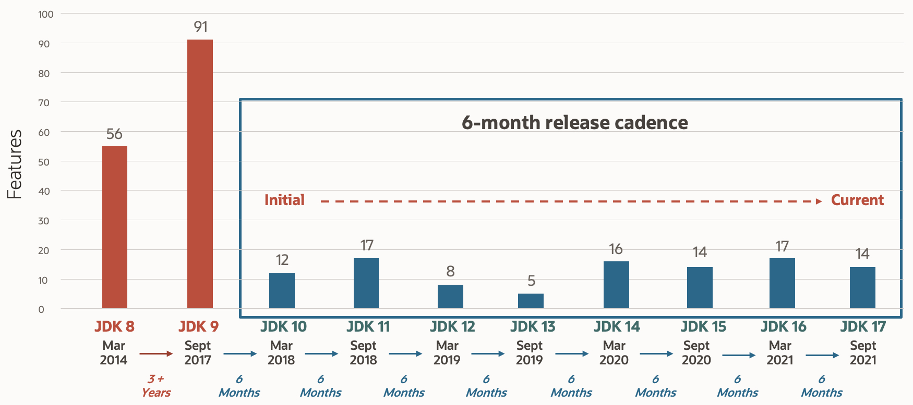
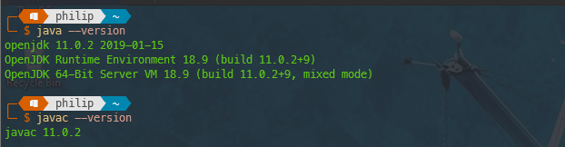
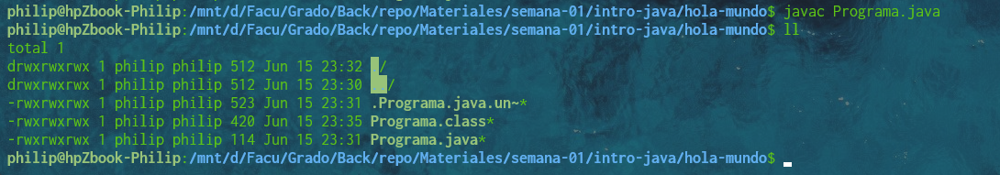
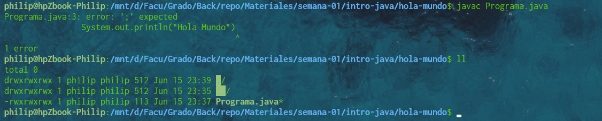
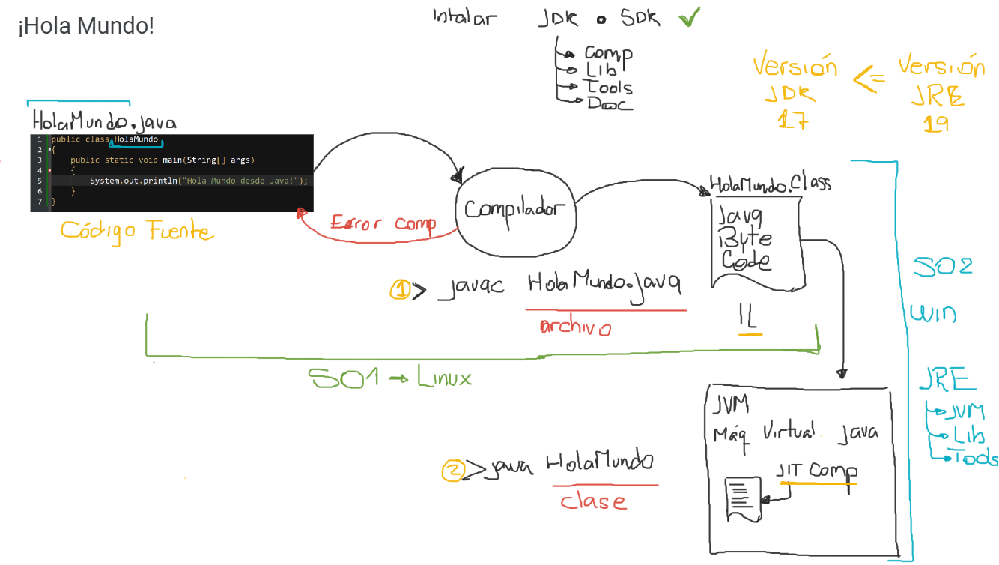
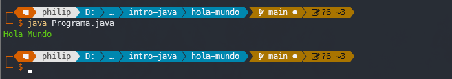
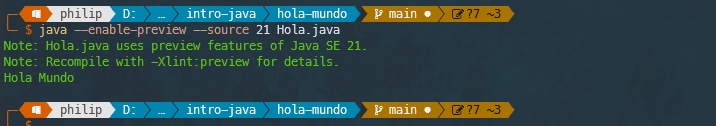

# Apunte de Clase 2 - Java

En el presente apunte vamos a abordar dos temas clave en la introducción de la asignatura. Por un lado vamos realizar una revisión de los elementos fundantes de la Plataforma Java, vamos a realizar una breve recopilación histórica de cómo Java llegó a ser una de las plataformas de desarrollo de software más utilizadas del mundo hoy en día, enumeraremos las versiones o ediciones disponibles de java y describiremos brevemente su función en la plataforma.

En segundo lugar vamos a desarrollar un ```HolaMundo``` con Java, pero no con el objetivo de realizar un análisis del código requerido que vamos caracterizar brevemente, sino con el objetivo de comprender los componentes necesarios para programar en java, qué debemos instalar en nuestra máquina para desarrolla y qué función cumplen estos instaladores.

## Introducción a la Plataforma Java

## Breve referencia histórica de la Plataforma Java

A comienzos de la década de 1990, el lenguaje C++ era el preferido por los desarrolladores para la creación de aplicaciones. Este lenguaje (cuya especificación fue definida por B. Stroustrup) reunía la potencia del C estándar con la programación orientada a objetos, y aunque no fue el primer lenguaje de objetos, fue el primero en ser usado para desarrollos profesionales.

Hacia 1991 un equipo de ingenieros de la firma Sun Microsystems generaron un proyecto llamado de The Green Project, liderado por James Gosling y Patrick Naughton, este equipo comenzó a trabajar en el diseño de un lenguaje de programación que pudiera usarse para programar dispositivos electrodomésticos. Ese lenguaje debía tener la capacidad de adaptarse a distintos tipos de dispositivos y procesadores, siendo capaz de generar programas que pudieran correr en cualquier tipo de dispositivo que soportara al lenguaje. Originalmente ese lenguaje se llamó *7 (léase: star seven), pero ese nombre no fue muy bien recibido por la comunidad de programadores y se propuso cambiarlo al nombre Oak por un roble que había fuera de la oficina.

Sin embargo, ya existía una marca de software con ese nombre por lo que debió ser cambiado otra vez y luego de pasar or el nombre Green (del proyecto en el que estaban) terminó llamándose Java. Se dice que algunos miembros del equipo de trabajo de Gosling y Naughton estaban tomando un café discutiendo sobre el nuevo nombre del lenguaje, y alguien notó que estaban tomando "café de la cafetería Java". Sin más, se propuso el nombre Java para el nuevo lenguaje, y eso explica también por qué el logotipo del lenguaje es una taza de café humeante (Aunque no hay fundamento real acerca de esta creencia).

Por los motivos ya indicados, el lenguaje Java se diseñó para poder generar programas que sean portables de una plataforma a otra. Vale decir: un programa desarrollado en un tipo de computadora con cierto tipo de sistema operativo debería poder llevarse a otro tipo de computadora con un sistema operativo diferente, sin tener que cambiar el programa y sin tener que volver a compilar - vamos a volver sobre este tema cuando hagamos el _Hola Mundo_. La idea era buena y el lenguaje tenía elementos que lo hacían muy flexible y poderoso. Entre sus características, se decidió que sea basado en objetos, y que su núcleo de instrucciones fuera similar al de C++ en la mayor medida posible, para facilitar la migración de programadores de ese lenguaje hacia Java. Sin embargo, el mercado no estaba listo para un lenguaje con esas características: aún no era masiva la cantidad de electrodomésticos programables disponibles, ni la necesidad de contar con un lenguaje avanzado para programarlos.

También en 1991, la Internet fue liberada para su uso comercial y eso provocó un cambio profundo en las estrategias de comercialización, transmisión de datos, comunicaciones y (por supuesto) en el diseño y desarrollo de sistemas informáticos. Hasta ese momento Internet era usada sólo en ámbitos académicos y gubernamentales de los Estados Unidos, y era controlada por la Fundación Nacional de Ciencia (NSF: National Science Foundation). Internet ofrece numerosos servicios, entre los cuales se encuentra la World Wide Web (o simplemente, la web) a través de la cual todas las computadoras enlazadas a la red pueden acceder a información gratuita sobre prácticamente cualquier tema que haya sido publicado, hoy en día, incluso sobre cualquier dispositivo conectado como lo son centrales meteorológicas, o sensores sísmicos o infinidad de dispositivos de lo que se denomina Internet de las Cosas o IoT por su sigla en ingles.

Con el dramático incremento en el uso de la Internet, pronto se vio que Java podría ser muy útil para programación de páginas web más atractivas que las que hasta ese momento se producían. El lenguaje HTML de las páginas web no es un lenguaje de programación sino un lenguaje de formateo de texto, y no se podía hacer con HTML que una página incluyera gráficas o animaciones sofisticadas, ni procesamiento de datos. Pero con Java podían crearse pequeños programas llamados applets, los cuales podrían incluirse dentro de una página web y descargarse en la computadora del usuario. Como Java es portable, no importaba si ese applet se desarrollaba en un contexto Windows y luego se descargaba en una computadora con Linux (o viceversa): el applet se ejecutaría sin problemas si el navegador web usado soporte Java, hoy en día esa batalla se perdió a manos de Javascript pero los primeros juegos en línea se programaron como Applets Java. En aquel momento mediante applets, un programador web adquiría mayor flexibilidad en la programación y muchos más elementos gráficos que con HTML, y Java se relanzó como lenguaje adquiriendo de inmediato un éxito rotundo.

Con el tiempo, surgieron otros lenguajes capaces de introducir programación compleja en una página web. Los lenguajes de script (como JavaScript o Visual Basic Script) así como Flash, son un claro ejemplo de ello. Pero Java no era (ni es) un simple lenguaje para programación de applets, aunque les deba su popularidad inicial a los applets. Java es un lenguaje multipropósito: permite desarrollar sistemas de amplia gama y hoy en día es muy utilizado para programación de aplicaciones de negocios (soluciones informáticas integrales para la gestión de las actividades de una empresa de cualquier magnitud).

Estas aplicaciones son independientes de sus interfaces, es decir pueden ser consumidas por distintos tipos de interfaces de usuario, están alojadas en servidores para ser accedidas de manera remota y se conectan con todo tipo de sistemas en infinidad de tecnologías distintas, es a esto a lo que vamos a llamar backend y para lo que Java es uno de los principales exponentes del mercado en la actualidad.

## Versiones de Java

### Introducción al esquema de versionado

Desde su lanzamiento en 1996, Java evolucionó a través de muchas versiones. Cada una de ellas incorporaba soluciones a problemas de la versión anterior, mejoras, y también librerías o paquetes de clases que no necesariamente eran desarrolladas desde Sun Microsystems sino también por terceras organizaciones específicamente dedicadas a producir esas librerías (también llamadas APIs por Application Programming Interface o Interfaz de Programación de Aplicaciones) para Java. Cada versión de Java se identifica históricamente con números separados por puntos. Así que, si bien por allá por 1991 ya había algunos programas Java en ejecución, la primera versión de Java es de 1996 fue la versión Java 1.0 y hacia 1997 se lanzó la versión Java 1.1 que incluía una API (llamada Abstract Windowing Toolkit o AWT) para el desarrollo de interfaces de usuario basadas en ventanas. En 1998 lanzó la versión Java 1.2 agregaba una nueva y muy potente API (conocida como Swing, que era el nombre código del equipo de desarrollo que la diseñó) para el desarrollo de interfaces de usuario y muchas otras características que instalaron a Java definitivamente como uno de los lenguajes líderes para el desarrollo de aplicaciones de negocio.

A partir de esta versión comenzó a usarse el nombre general _**Java 2**_, específicamente _**J2**_ para referirse alas distintas ediciones de Java 1.2 y a las subsiguientes versiones que aparecerán después: Java 1.3 en el año 2000 y Java 1.4 en el año 2002. De hecho, a partir de entonces el conjunto de herramientas para programación Java disponible desde la versión Java 2, se conoce también como J2SE (abreviatura de Java 2 Standard Edition). Existe aún hoy gran cantidad de documentación en Internet que hace referencia a Java desde J2XX donde las 'X' hacen referencia a la edición en cuestión.
En el año 2004 apareció Java 5.0 (note que la versión comercial ya no se designa como Java 1.5 sino directamente como Java 5.0, aunque internamente el nombre Java 1.5 se usaba todavía. Quedó en la anécdota del marketing mundial el hecho que no haya existido una versión oficialmente llamada Java 3 ni una llamada Java 4...) Esta versión Java 5.0 es realmente una nueva versión del lenguaje y no una corrección o conjunto de mejoras a la versión anterior. La versión Java 5.0 incorpora elementos que cambian el núcleo del lenguaje, tales como clases genéricas, enumeraciones y una variante mejorada del ciclo for.

Aquí habría que abrir un importante debate acerca del concepto retro-compatibilidad hacia atrás que Java ha mantenido a lo largo de toda su historia y que trae dolores de cabeza a la comunidad por volverse el impedimento de avance y mejora continua de la plataforma, dejamos este punto para lectura de cada estudiante y debate grupal.

En diciembre de 2006 apareció Java 6 (sí, Java 6 y NO Java 6.0) imponiendo aún nuevos cambios y mejoras. A partir de esta versión, se elimina la designación J2SE y se cambia directamente por Java SE (lo cual era una necesidad obvia desde la versión Java 5.0) Entre los años 2009 y 2010, Sun fue adquirida por la empresa Oracle, y en 2011 apareció la versión Java SE 7. Luego también existió la versión 8, Java SE 8 con su nuevo conjunto de funcionalidades.

La versión 9 de java, Java SE 9 fue la última versión de java como originalmente se conoció, luego del cambio a manos de Oracle la última versión con el esquema desde la Java 5 es la 7, a partir de dicha versión y en sintonía con una gran cantidad de productos de software se pasó al esquema de versiones con soporte de largo término o LTS por su sigla en inglés y versiones de actualizaciones periódicas.

  

Luego del cambio a cadencia de 6 meses siguieron las versiones 10 y 11 esta última, versión LTS, tuvo un importante cambio pues pasó a ser Licenciada por Oracle y genero un gran movimiento de la comunidad para proponer máquinas virtuales alternativas que ya se venían desarrollando y que mantuvieron el concepto de uso libre, que no es lo mismo que Open Source o código abierto, sin embargo entre todas ellas la propia Oracle junto a Red Hat esponsorearon a OpenJDK que es quien mantienen la actualización de las versiones libres de Java.

### Versión actual de Java (este apartado va a estar siempre desactualizado :) )

Así la última versión LTS de java es la versión Java SE 21 que al ser una versión LTS garantiza el soporte hasta Septiembre de 2031, ya está disponible también la versión menor 22. La versión 25 que vendrá a ser la próxima LTS tiene fecha planificada de pasar a GA en Septiembre del 2025.

No siendo esta asignatura un curso de Java no tendremos posibilidad de revisar en detalle las novedades de la versión o versiones sucesivas pero basta con una búsqueda en internet para observar el nivel de detalle de los cambios que parecen en la versión.

[Notas del Release 21 del sitio de Oracle](https://www.oracle.com/java/technologies/javase/21-relnote-issues.html)

### Ediciones de Java

Ahora nos encontramos con el principal escollo a la hora de conseguir documentación de Java ya que la propia palabra Java se asocia a conceptos muy diferentes, en el siguiente apartado intentaremos al menos nombrar los principales estratos a los que se asocia la palabra Java con una breve referencia a cada uno.

_**Java SE (Standard Edition)**_: La edición estándar de Java es considerada la versión core o central de java, ella incluye las herramientas necesarias para poder programar en Java y otras herramientas para empaquetar nuestros componentes Java o Documentar los mismos entre otras muchas herramientas de soporte al proceso de desarrollo. Además incluye el conjunto principal de APIs o Librerías propias del lenguaje de programación Java que van desde Colecciones hasta acceso a Base de Datos y ORM pasando por entrada/salida, redes e hilos entre otras.

_**Java EE (Enterprise Edition)**_: La edición empresarial de java o Java EE se ha utilizado históricamente para desarrollar aplicaciones empresariales en Java. Sin embargo, en la actualidad, Oracle transfirió la responsabilidad de Java EE a la Fundación Eclipse, donde se ha convertido en el proyecto Jakarta EE.

Ya Siendo Jakarta EE, se organizó en Perfiles o conjuntos de Librerías y APIs orientados a diferentes propósitos:

- Perfil Web (Web Profile): Este perfil incluye tecnologías principales para el desarrollo de aplicaciones web empresariales, como Servlet API, JavaServer Faces (JSF), Java Persistence API (JPA) y Contexts and Dependency Injection (CDI).

- Perfil de Plataforma Completa (Full Platform Profile): Este perfil proporciona todas las APIs y especificaciones de Java EE, incluyendo las del perfil web, y agrega tecnologías adicionales como Enterprise JavaBeans (EJB), Java Message Service (JMS) y Java Transaction API (JTA).

- MicroProfile: Desarrollado por la comunidad, MicroProfile es un conjunto de especificaciones y APIs diseñadas para facilitar el desarrollo de microservicios basados en Java. Ofrece características como la configuración externa, tolerancia a fallos, métricas y seguridad. MicroProfile ha ganado popularidad debido a su enfoque ligero y su capacidad para impulsar la arquitectura de microservicios en Java.

_**Java ME (Micro Edition)**_: La edición Micro de Java originalmente se creó para la programación de dispositivos móviles, sin embargo, esta edición se enfoca actualmente en la Internet de las cosas (IoT).

_**Java Card**_: Java Card se utiliza para desarrollar aplicaciones seguras en tarjetas inteligentes y dispositivos con recursos limitados.

_**Java FX**_: Java FX es una plataforma de desarrollo de interfaces de usuario (UI) rica y moderna para aplicaciones de escritorio, web y móviles. Proporciona un conjunto de bibliotecas y herramientas para crear interfaces de usuario interactivas y atractivas en modo declarativo. Java FX se ha convertido en un proyecto de código abierto y se ha trasladado a la Fundación OpenJFX.

## El lenguaje de Programación Java

Unos de los principales sino el principal elemento de Java SE es el Lenguaje de Programación Java, el lenguaje de programación en el que se escriben todos los componentes en todas las ediciones más allá de otros lenguajes utilizados para configuración, intercambio o ejecución de los programas.

Como todos los lenguajes de programación está basado en ciertas características específicas y estas lo hacen una versión un lenguaje único que ocupa un espacio que ningún otro de los lenguajes existente puede a excepción quizás de C# que puede ser el que más se asemeja.

### Características de Java

Entre las principales características del Lenguaje de Programación Java debemos citar:

- De Alto Nivel: es un lenguaje que está más cerca de ser legible por el ser humano que de las instrucciones del procesador y por otro lado contiene una amplia gama de librerías y código ya desarrollado que permite que el programador se pueda centrar en las funcionalidades a programar e independizarse de las cuestiones de infraestructura física de las computadoras.
- Orientado a objetos: Al contrario de otros lenguajes como C++, Java no es un lenguaje modificado para poder trabajar con objetos, sino que es un lenguaje creado originalmente para trabajar con objetos. De hecho, todo lo que hay en Java son objetos.
- Independiente de la plataforma: Debido a que existen máquinas virtuales para diversas plataformas de hardware, el mismo código Java puede funcionar prácticamente en cualquier dispositivo para el que exista una JVM.
- Compilado e Interpretado (la JVM es más que un intérprete y NO es correcto decir que es un intérprete, pero mantiene el mismo concepto y nos permitimos invitar al estudiante a revisar las diferencias específicas): La principal característica de Java es la de ser un lenguaje compilado e interpretado. De este modo se consigue la independencia de la máquina, el código compilado se ejecuta en máquinas virtuales que sí son dependientes de la plataforma o sistema operativo. Para cada sistema operativo distintos, ya sea Microsoft Windows, Linux, macOS, existe una máquina virtual específica que permite que el mismo programa Java pueda funcionar sin necesidad de ser recompilado.
- Gestiona la memoria automáticamente (Memory Safe): La máquina virtual de Java gestiona la memoria dinámicamente como veremos más adelante. Existe un recolector de basura que se encarga de liberar la memoria ocupada por los objetos que ya no están siendo utilizados.
- Multihilos (multithreading): Soporta la creación de partes de código que podrán ser ejecutadas de forma paralela y comunicarse entre sí.

## Hola Mundo en Java

El programa _**Hola Mundo**_, que tiene su origen en el libro _"El Lenguaje de Programación C"**_ de Brian Kernighan y Dennis Ritchie, tiene por objeto mostrar los elementos necesarios para escribir programas en un lenguaje de programación, en este caso en Java. No es su objetivo el estudio del Lenguaje propiamente dicho, sino poder conocer las herramientas necesarias para llevar ese programa desde el código fuente al programa en ejecución.

A continuación, y con el mismo objeto, vamos a desarrollar el programa Hola Mundo pero en Java.

### 1 El código fuente

Lo primero que vamos a tener que hacer es crear un archivo de texto, cosa que podemos hacer con cualquier editor de texto. Todos los sistemas operativos incluyen al menos una herramienta de edición de archivos de texto, en el mi caso podría usar directamente ```vim``` por línea de comandos para hacerlo. También podemos usar una herramienta con interfaz de usuario como Notepad++, Atom o Sublime Text por nombrar algunos famosos.

Entonces en un archivo de código fuente vamos a escribir el siguiente código Java:

```java
public class Programa {
    public static void main(String[] args) {
        System.out.println("Hola Mundo");
    }
}
```

La primera restricción del lenguaje de programación Java es que este archivo no puede tener cualquier nombre, se _**debe**_ llamar ```Programa.java``` la primera parte debe coincidir con el nombre de la clase declarada dentro y debe tener la extensión ```.java``` estos elementos son obligatorios para que todo lo que sigue pueda funcionar.

Si bien no vamos a hacer una revisión exhaustiva del lenguaje Java, es imposible no mencionar algunos elementos generales y distintivos de este lenguaje:

- Es un lenguaje Case Sensitive, por lo que las letras minúsculas y mayúsculas son considerados símbolos diferentes es decir ```Programa``` no es lo mismo que ```programa```.
- Divide los bloques con llaves, es decir que utiliza ```{``` para indicar el inicio de un bloque de código y ```}``` para indicar el final del bloque, esto lo diferencia de otros lenguajes que utilizan palabras como begin y end o tabulaciones para marcar el principio y final de los bloques.
- Utiliza _**obligatoriamente**_ ```;``` para terminar una sentencia de código, esto lo diferencia de otros lenguajes que utilizan el salto de línea para terminar una sentencia.

Finalmente, solo mencionar que este fragmento de código el método de clase main de la clase Programa es un método especial y es considerado el punto de inicio de nuestro programa Java y por lo tanto debe ser definido estrictamente como está en el ejemplo. Más adelante veremos el significado de cada una de las palabras reservadas en el bloque y qué porción de dicha definición se puede modificar.

### 2 El compilador

El compilador Java es una de las herramientas provistas por Java SE y es central en la programación Java, para disponer de esta herramienta será necesaria la instalación del Kit de Desarrollo de Software Java o Java SDK (Cabe destacar que para los programadores Java se sigue llamando y se llamará siempre Java JDK por Kit de Desarrollo Java simplemente).

Más adelante haremos un breve debate acerca de las diferentes opciones de instalación del JDK pero en general vamos a recomendar instalaciones diferentes para linux y widnows basados en la simplicidad de instalación y sabiendo que en el uso que vamos a dar cualquiera de las dos versiones es compatible con todo lo que vamos a hacer en la asignatura

#### Instalación en Linux

En el caso de linux vamos a instalar el paquete de OpenJDK 17 disponible para todas las distribuciones, por ejemplo en el caso de alguna distribución que soporte apt deberíamos ejecutar los siguientes comandos:

```bash

$ sudo apt update -y && sudo apt upgrade -y
...actualiza el Linux y el administrador de paquetes apt

$ sudo apt install openjdk-21-jdk -y
... instala java openjdk 21

```

#### Instalación en Windows

En el caso de Windows vamos a recomendar la instalación de Oracke JDK 17 porque podemos usar un instalador no tendremos que configurar manualmente las variables de entornos (aunque siempre está la opción de descargar el zip del sitio de Open JDK y realizar la instalación manual)

[Descarga del JDK de Oracle](https://download.oracle.com/java/21/archive/jdk-21.0.3_windows-x64_bin.exe)

Ejecutar el instalador y seguir los pasos.

Una vez realizada la instalación por alguno de los mecanismos expuestos, o algún otro mecanismo deseado, debería verificar que la instalación funcionó correctamente como sigue:

  

Habiendo validado la instalación de Java como mencionamos, estamos en condiciones de compilar nuestra clase. Para ello vamos a usar el compilador java este es el programa ```javac``` (por Java Compiler) y como entrada al compilador le vamos a dar el nombre del archivo que contiene la clase a compilar.

Entonces, estando ubicados en el directorio donde tenemos nuestra clase programa vamos a ejecutar:

```powershell
> javac Programa.java

```

Si el resultado es simplemente la siguiente línea de comandos como vemos en la imagen significa que la compilación fue exitosa y que podemos ver el archivo de salida en el propio directorio.

  

En el caso en que exista un error de compilación, el proceso va a fallar, no se va a crear ningún archivo nuevo y vamos a poder ver una referencia al primer error encontrado por el compilador, a continuación un ejemplo donde falta el ```;```:

  

En este caso, deberemos volver al código fuente, corregir el error encontrado y repetir este proceso hasta lograr que la compilación sea exitosa.

### 3 El archivo de código binario Java o Java Byte Code

En el caso de que el proceso de compilación haya resultado exitoso, obtendremos como resultado un nuevo archivo, que tendrá siempre un nombre compuesto por el nombre de la clase, es decir, el mismo nombre que el archivo punto java, en nuestro ejemplo ```Programa```, pero ahora con la extensión .class, es decir ```Programa.class``` como podemos observar en la imagen anterior.

En el contexto de Java, el bytecode es el conjunto de instrucciones de bajo nivel que se genera cuando se compila un programa Java. A diferencia de otros lenguajes de programación, donde el código fuente se compila directamente a código máquina específico del sistema operativo, Java utiliza un enfoque diferente.

Cuando desarrollamos en Java, el código fuente (.java) se compila utilizando el compilador de Java (javac), que traduce el código fuente a bytecode. El bytecode resultante se almacena en archivos con extensión .class. Estos archivos .class contienen instrucciones que son ejecutadas por la Máquina Virtual de Java (JVM), que es un componente crucial en la plataforma Java.

El bytecode de Java es independiente de la plataforma, lo que significa que se puede ejecutar en cualquier sistema que tenga una implementación de la JVM. Esto se debe a que la JVM es responsable de interpretar y ejecutar el bytecode en tiempo de ejecución, sin importar el sistema operativo subyacente. De esta manera, el código Java es altamente portátil y puede ejecutarse en diferentes entornos sin necesidad de realizar modificaciones significativas.

El bytecode de Java es un conjunto de instrucciones orientadas a objetos. Cada instrucción es representada por un código de operación (opcode) seguido de sus operandos, si los tiene. Estas instrucciones son ejecutadas secuencialmente por la JVM durante la fase de ejecución del programa.

Una ventaja clave del bytecode es que proporciona una capa adicional de seguridad. Antes de que se ejecute el bytecode, la JVM realiza una verificación de seguridad para garantizar que no haya violaciones en tiempo de ejecución, como acceso a memoria no autorizada o violaciones en la manipulación de objetos. Esta verificación de seguridad ayuda a prevenir problemas graves y mejora la confiabilidad del programa.

Además, el bytecode también permite la implementación de características de nivel superior en Java, como la gestión automática de memoria (a través del recolector de basura), el soporte para reflexión (que permite inspeccionar y manipular clases y objetos en tiempo de ejecución) y la administración de excepciones.

En resumen, el bytecode de Java es un conjunto de instrucciones de bajo nivel que se genera al compilar el código fuente de Java. Este bytecode es interpretado y ejecutado por la JVM, lo que proporciona portabilidad y seguridad al lenguaje Java. Es gracias a esta combinación de bytecode y JVM que los programas Java pueden ejecutarse en múltiples plataformas sin requerir modificaciones significativas.

### 4 Ejecución

Habiendo obtenido el archivo de código binario de java a partir de un proceso de compilación exitosa, ahora nos resta ejecutar el programa, pero como ya hemos dicho antes, esta ejecución no es automática ni independiente pues este código binario java NO ES una aplicación ejecutable.

Va a ser necesaria la ya nombrada Máquina Virtual Java o JVM por su sigla en inglés, si hemos descargado e instalado el JDK ya contamos con dicha máquina virtual puesto que como explicaremos en el siguiente apartado está incluida para probar lo que desarrollamos pero si necesitáramos ejecutar nuestro programa en una máquina donde no vamos a programar, no es necesario descargar el JDK sino que tenemos la opción de descargar un JRE (por Java Runtime Environment) o Entorno de Ejecución Java que solo tiene los elementos necesarios para ejecutar una aplicación java y no, las herramientas de programación.

Entonces teniendo la máquina virtual solo nos queda ejecutar la aplicación, para ello vamos a ejecutar la JVM y le vamos a pasar como parámetro el _**nombre de la clase**_ que contiene el método main:

  

Notar que no escribimos .class sino solo el nombre de la clase, aquí podría surgir la pregunta: ¿cómo hace la máquina virtual para encontrar el archivo con el bytecode correspondiente a la clase?. Si hacemos un poco de memoria, cuando comenzamos planteamos una sola restricción que era que el nombre del archivo de código fuente debía llamarse como la clase que contenía; y luego dijimos, que el compilador siempre llama el resultado de la compilación con el mismo nombre que el archivo .java pero con la extensión .class.

Entonces, si nosotros ejecutamos invocando a la máquina virtual y diciéndole el nombre de la clase que tiene que ejecutar, la máquina virtual puede inferir que debe buscar un archivo con el nombre compuesto por \<nombre de la clase\> más la extensión .class.

> **Nota:** a partir de la versión 11 Java incluye la posibilidad de ejecutar directamente el archivo de la clase, es decir el archivo ```Programa.java```, sin embargo esto simplemente está provocando el proceso en memoria y sin escribir el bytecode de manera local y no es el esquema de ejecución cuando vamos a desplegar software de ejecución real.
>   

### ¿Por qué se dice que Java es multiplataforma?

Hasta ahora hemos recorrido el camino que nos llevó desde el código fuente original que escribimos para imprimir la cadena “Hola Mundo” en la pantalla, hasta el programa que comprobamos que efectivamente lo hizo.

Ahora bien, más allá de que algo mencionamos al respecto, ¿dónde explícitamente radica el hecho de la multiplataforma?, bueno, para lograr comprender este concepto primero debemos al menos revisar la diferencia que existe entre JDK y JRE específicamente y donde radica la máquina virtual. Respecto del JDK ya hemos explicado bastante y en resumidas cuentas sin descargar e instalar el JDK no podemos programar puesto que este paquete es quien me provee el compilador java entre otras muchas herramientas, y por otro lado también me provee un JRE para probar lo que yo programo en la misma PC, donde estoy programando.

El punto está en que también puedo descargar e instalar de forma separada solo el JRE, y en este caso no estaríamos en condiciones de programar, pero sí de ejecutar un programa ya compilado.

Entonces nosotros podemos realizar el proceso de escritura de código y compilación en cualquier plataforma o sistema operativo para el cual contemos con un JDK, es decir, para el cual exista una versión de JDK que podamos descargar e instalar. Con esto obtendremos como resultado de esta fase un archivo o conjunto de archivos Java Bytecode o .class, los cuales ya dijimos cumplen un rol importante aquí, ¿por qué?, es evidente que en la misma máquina donde programamos y compilamos ejecutamos la aplicación, podremos hacerlo, ya dijimos, el JDK incluye un JRE.

Pero si fuese necesario ejecutar la aplicación en una PC donde nunca he programado y no voy a programa jamás, por ejemplo la PC de mi mamá, o peor aún en una plataforma o sistema operativo para la cual no existe un JDK pero sí existe un JRE, yo podría tomar mis archivos de bytecode copiarlos a la plataforma destino para la cual cuento con un JRE y simplemente ejecutarlos aquí, cosa que no solo es posible, sino que además se lleva a cabo de la manera óptima para esta plataforma puesto que el JRE y por añadidura la JVM contenida está optimizada para la plataforma para la que fue creada.

En este escenario que describimos estaríamos en presencia de un proceso multiplataforma real y donde aprovecharemos esta característica del lenguaje de programación Java brindada gracias a la existencia de Bytecode. Java en este caso estaría manteniendo el concepto inicial de escribir el código y compilarlo una vez en alguna plataforma para la que exista un JDK disponible y luego poder ejecutarlo, a partir de los archivos de bytecode, en cualquier plataforma para la que exista una Máquina Virtual o lo que es igual, cualquier plataforma para la que exista un JRE disponible y ese es, esencialmente, el esquema de funcionamiento de las aplicaciones Java.

### En resumen

  

### Algunas alternativas al esquema tradicional

Desde la versión 11 de Java podemos omitir el paso de compilación, es decir podemos directamente ejecutar la máquina virtual brindando un archivo `MiClase.java` como parámetro de entrada y la máquina virtual va a provocar una compilación en línea y va a ejecutar la clase. Por ejemplo si nos basamos en el archivo `Programa.java` construido antes:

  

En este caso se omite la creación del archivo `MiClase.class` el cual se genera en memoria y es una versión útil para la ejecución de scripts o la realización de pruebas.

#### Unnamed Classes and Instance Main Methods (Preview)

Esta nueva versión de Java 21 agrega la posibilidad de construir un script sin la palabra reservada `class` y con un método main simplificado en línea con la particularidad anterior imitando un poco la idea de Python a la hora de escribir scripts de rápida ejecución / implementación.

Así podríamos por ejemplo escribir el archivo `Hola.java` con el código del método main exclusivamente:

```java

void main() {
    // Notar que no hacer falta el parámetro del método main y se omite public y static
    System.out.println("Hola Mundo");
}

```

El archivo `Hola.java` entonces, solo contendrá el código antes mencionado, y a partir de este luego podremos ejecutar directamente con el método abreviado existente desde la versión 11 de Java:

  

Notar que para ello tendremos que agregar las opciones de máquina virtual `--enable-preview` para habilitar el uso del acceso temprano a las novedades de la versión y este parámetro requiere que le indiquemos sobre que versión queremos hacer preview para lo que vamos a usar el parámetro `--source` con la versión 21 para configurar que queremos los preview de la versión 21 de Java.

Sin embargo, más allá de la aclaración de la versión y del preview se puede observar como esta evolución del lenguaje permite la creación de scripts livianos de de ejecución directa a partir del archivo de código.

## Breve debate sobre las diferentes JVMs existentes

Lo prometido es deuda aquí un brevísimo repaso sobre las distintas máquinas virtuales java existentes:

1. HotSpot VM (Oracle/OpenJDK):

    **Ventajas**: HotSpot VM es una de las máquinas virtuales más utilizadas y optimizadas en la actualidad. Ofrece un alto rendimiento y una amplia gama de características avanzadas, como la optimización Just-In-Time (JIT) y la recolección de basura adaptativa.

    **Desventajas**: Algunas de las desventajas incluyen que puede tener un mayor consumo de memoria y una latencia de inicio ligeramente más larga en comparación con algunas otras máquinas virtuales más ligeras.

2. OpenJ9 (Eclipse Adoptium, anteriormente conocido como IBM J9):

    Ventajas: OpenJ9 es conocido por su eficiencia y bajo consumo de memoria. Es una excelente opción para aplicaciones que requieren una huella reducida en términos de recursos.

    Desventajas: Algunas aplicaciones pueden requerir ajustes y pruebas adicionales para garantizar una compatibilidad total con OpenJ9.

3. GraalVM:

    **Ventajas**: GraalVM es innovadora debido a su capacidad para ejecutar aplicaciones Java, JavaScript y otros lenguajes en una sola máquina virtual. También ofrece la posibilidad de compilar aplicaciones Java en imágenes nativas.

    **Desventajas**: Aunque es prometedora, GraalVM puede ser más compleja de configurar y usar en comparación con las máquinas virtuales Java más tradicionales.

4. Azul Zing:

    **Ventajas**: Zing se centra en la eliminación de los tiempos de latencia y la reducción de los problemas de rendimiento en tiempo real, lo que lo convierte en una opción preferida para aplicaciones críticas en tiempo real.

    **Desventajas**: Zing suele ser utilizado en casos específicos y puede ser más costoso que otras opciones.

5. SAP Machine:

    **Ventajas**: SAP Machine se ha optimizado para ejecutar aplicaciones SAP y es conocida por su estabilidad y soporte de nivel empresarial.

    **Desventajas**: Su uso está más centrado en aplicaciones SAP y puede no ser tan ampliamente utilizado como otras opciones generales.

La elección de la máquina virtual dependerá de las necesidades específicas del proyecto que se esté desarrollando, como el rendimiento, el consumo de recursos, la estabilidad y las características únicas que ofrezcan. Se recomienda investigar más sobre cada una de estas máquinas virtuales y considerar cómo se ajustan a las demandas de tu aplicación antes de tomar una decisión.

## 🧠 ¿Qué es realmente una Máquina Virtual? ¿Y por qué Java la necesita?

Antes de cerrar este apunte, vale la pena entender un poco más en profundidad qué es una **Máquina Virtual** y por qué Java se apoya en esta arquitectura para lograr su promesa de "escribir una vez, ejecutar en cualquier lado".

### Máquina Virtual: concepto general

Una **Máquina Virtual (VM)** es un entorno de ejecución que simula un sistema operativo o una computadora real. Permite ejecutar programas en un contexto controlado, **independiente del hardware físico**. En este entorno:

- Se aísla la ejecución del sistema operativo base (host)
- Se puede tener más de una VM por equipo físico
- Cada VM puede tener su propio sistema operativo, memoria, procesos, etc.

En el caso de Java, no hablamos de simular un sistema operativo entero, sino de algo más específico...

### ☕ La Java Virtual Machine (JVM)

Java no compila directamente a código nativo del procesador (como lo hace C o C++), sino que compila a **bytecode**, un lenguaje intermedio portable.

Ese bytecode **es interpretado o compilado en tiempo de ejecución** por la **Java Virtual Machine (JVM)**.

> 📌 Esto es lo que hace posible que un `.class` compilado en una máquina Linux con Intel, funcione en una Mac con ARM sin recompilar nada.

### Arquitectura básica de la JVM

La JVM está compuesta por:

| Componente               | Función principal |
|--------------------------|-------------------|
| **Class Loader**         | Carga los `.class` al iniciar |
| **Runtime Data Areas**   | Espacios de memoria para objetos, métodos, pilas de ejecución |
| **Execution Engine**     | Interpreta o compila a código nativo el bytecode |
| **Native Interface (JNI)** | Permite invocar código en C/C++ si es necesario |
| **Garbage Collector**    | Libera automáticamente objetos que ya no se usan |

### Detalles interesantes (nivel introductorio)

- **ClassLoader** carga clases dinámicamente. Si no encuentra una clase, lanza `ClassNotFoundException` o `NoClassDefFoundError`.
- **Heap y Stack**: los objetos viven en el heap; las variables locales y llamadas de métodos viven en la pila (stack).
- **Execution Engine** puede usar un **intérprete** (más lento pero inmediato) o un **JIT (Just-In-Time) compiler**, que convierte bytecode en código nativo más eficiente para métodos que se usan mucho.
- **Garbage Collector** se encarga de liberar memoria automáticamente; Java es "memory-safe" gracias a esto.

### ¿Por qué todo esto importa?

Porque este diseño:

- ✅ Asegura **portabilidad**
- ✅ Permite a Java ser **más seguro** (al estar aislado del sistema)
- ✅ Facilita **la optimización en tiempo de ejecución**
- ✅ Desacopla el lenguaje del hardware

Y sobre todo, nos da contexto para comprender **qué pasa realmente cuando ejecutamos un programa Java**.

> En síntesis: _el bytecode es universal, y la JVM es el traductor local que lo entiende en cada máquina donde se ejecute_*_.

## Enlaces relacionados

- [The 2024 Java Programmer RoadMap [UPDATED]](https://medium.com/javarevisited/the-java-programmer-roadmap-f9db163ef2c2) si bien es un artículo originalmente de 2021 que fue actualizado muestra un panorama completo del ecosistema Java y sus expectativas a futuro.
