# Apunte de clase 3 - Maven

## Introducción

Maven es una poderosa herramienta de construcción y gestión de proyectos que simplifica y automatiza muchas de las tareas comunes en el desarrollo de aplicaciones Java y otros lenguajes de programación. Su enfoque principal es proporcionar una forma coherente de estructurar, construir y administrar proyectos por un lado, y centralizar, administrar y disponer las dependencias de estos proyectos por el otro; lo que mejora la eficiencia y la colaboración en equipos de desarrollo.

Podemos entender a Maven desde 3 puntos de vista medianamente distintos, por un lado Maven como generador de estructuras de proyecto, por el otro lado maven como administrador y distribuidor de dependencias y finalmente, maven como orquestador del ciclo de vida del proyecto.

**_Generador de Estructuras de Proyecto:_**
Maven ofrece la posibilidad de utilizar `archetypes`, que son plantillas predefinidas para crear las estructuras básicas de los proyectos. Estos arquetipos definen la organización de directorios y archivos en un proyecto, incluyendo el archivo `pom.xml` (Project Object Model), que es el archivo de configuración del proyecto. Esto ayuda a los desarrolladores a seguir un patrón consistente. Al crear un nuevo proyecto, puedes elegir entre varios arquetipos predefinidos según el tipo de aplicación que estás construyendo o crear un arquetipo base para todos tus proyectos en base a un proyecto tipo construido especialmente. Esto garantiza que los proyectos tengan una estructura coherente desde el principio.

**_Administrador de Dependencias:_**
Una de las características más destacadas de Maven es su capacidad para administrar dependencias automáticamente. En lugar de descargar manualmente bibliotecas externas y gestionar sus versiones, Maven permite declarar las dependencias del proyecto en el archivo llamado `pom.xml`. Maven se encarga de descargar automáticamente las dependencias necesarias desde repositorios remotos, como Maven Central, y las incorpora en el proyecto. Esto simplifica en gran medida el proceso de gestión de dependencias y garantiza que todas las partes del proyecto utilicen las mismas versiones de bibliotecas.

**_Orquestador del Ciclo de Vida del Proyecto:_**
Maven se encarga de coordinar el ciclo completo de construcción de un proyecto, desde la compilación y la ejecución de pruebas hasta la generación de artefactos binarios, como archivos JAR o WAR. A través de comandos simples, como `mvn compile`, `mvn test` o `mvn package`. Maven automatiza estas tareas y garantiza que el proceso de construcción sea consistente y predecible. También permite configurar y personalizar las fases de construcción según las necesidades del proyecto.

En resumen, Maven es una herramienta esencial en el desarrollo de aplicaciones Java que ofrece un enfoque coherente para generar estructuras de proyecto, administrar dependencias y coordinar el ciclo de construcción. Su capacidad para simplificar tareas comunes y mejorar la eficiencia en el desarrollo hace que sea ampliamente utilizado en la comunidad de desarrollo y en entornos DevOps.

## Un poco más de detalle sobre las Funciones de Maven

### Generador de Estructuras de Proyecto

Maven proporciona una amplia variedad de arquetipos (plantillas) que te permiten crear proyectos Java de diferentes tipos, como aplicaciones web, aplicaciones de consola, bibliotecas, etc. Los arquetipos establecen una estructura de directorios y archivos estándar para tu proyecto. Algunos conceptos clave relacionados con los arquetipos son:

Artefacto: Un producto generado por Maven, como un archivo JAR o un archivo WAR, que contiene el código compilado y las dependencias del proyecto. Es la unidad de compilación o componente indivisible dentro de la infraestructura Java y recibe un identificador que en conjunto con el GroupId y la Versión deben ser únicos.

Esencialmente un artefacto está asociado al proyecto y se compone de un directorio contenedor con el archivo `pom.xml` y la estructura de directorios y archivos del proyecto.

Para poder crear un proyecto maven a partir de un arquetipo será necesario especificar:

**GroupId**: Identificador del grupo al que pertenece el proyecto. Suele ser el nombre del dominio de la organización al revés, por ejemplo, `ar.edu.utnfc.backend`.

**ArtifactId**: Identificador único del artefacto. Es el nombre del proyecto. El nombre de artefacto normalmente se define utilizando spinal case, por ejemplo: `hola-mundo`.

**Version**: Número de versión del artefacto. Según la convención es un conjunto de 3 números separados por punto seguidos de un guion y las palabras SNAPSHOT o RELEASE determinando si hablamos de una versión en desarrollo o de una versión definitiva del artefacto.

Estos datos requeridos al crear el proyecto como ya veremos, luego pueden ser editados en el archivo `pom.xml` donde quedan especificados.

Lectura complementaria: [Creación de proyectos con Maven Archetypes](!https://maven.apache.org/guides/introduction/introduction-to-archetypes.html)

### Administrador de Dependencias

**_Dependencias en un Proyecto:_**
En el contexto del desarrollo de software, una dependencia es una entidad externa (como una biblioteca, una API o un módulo) que es utilizada por una aplicación o un proyecto para cumplir ciertas funciones. Las dependencias permiten reutilizar código y funcionalidades existentes en lugar de reinventar la rueda en cada proyecto. Sin embargo, la gestión de dependencias puede volverse complicada si no se controla adecuadamente.

El "DLL Hell" (infierno de las DLL) es un término que se originó en el mundo de Windows y se refiere a los problemas que surgían cuando múltiples aplicaciones dependían de diferentes versiones de una misma librería de vínculos dinámicos (DLL, Dynamic Link Library). Esto llevaba a conflictos y errores cuando las aplicaciones no podían encontrar o utilizar las versiones correctas de las DLL que necesitaban. Este problema surgió debido a la falta de un mecanismo efectivo para gestionar y aislar las dependencias en el sistema operativo.

**_Evolución hacia la Administración de Dependencias de Maven:_**
La administración de dependencias evolucionó para abordar el problema del "DLL Hell" y los desafíos asociados con la gestión manual de bibliotecas y componentes en proyectos de software. Maven, introducido en 2004, revolucionó la forma en que se manejan las dependencias en proyectos Java y estableció un enfoque coherente y automatizado.

Maven resuelve automáticamente las dependencias del proyecto, descargando las bibliotecas requeridas desde repositorios remotos y configurándolas para su uso en el proyecto. Algunos conceptos clave relacionados con la administración de dependencias son:

Dependency Management: Declaración de dependencias en el archivo pom.xml utilizando la etiqueta `<dependency>`. Maven descargará y gestionará estas dependencias automáticamente.

Repositorios: Maven utiliza repositorios remotos (como Maven Central) para buscar y descargar dependencias. También puedes configurar repositorios locales o privados.

Transitive Dependencies: Maven resuelve automáticamente las dependencias transitivas, es decir, las bibliotecas que son necesarias debido a otras dependencias.

Lectura complementaria:
[Gestión de Dependencias en Maven](!https://maven.apache.org/guides/introduction/introduction-to-dependency-mechanism.html)

#### Características Clave de la Administración de Dependencias en Maven

**Declaración Declarativa**: En lugar de descargar y administrar dependencias manualmente, Maven permite declarar las dependencias en un archivo pom.xml, especificando el grupo, el artefacto y la versión. Maven se encarga de descargar y gestionar estas dependencias.

**Resolución Automática**: Maven resuelve automáticamente las dependencias transitivas, es decir, las bibliotecas requeridas por otras dependencias. Esto evita problemas de compatibilidad y asegura que las versiones correctas se utilicen en todo el proyecto.

**Repositorios Centrales y Remotos**: Maven utiliza repositorios centralizados (como Maven Central) para almacenar y distribuir dependencias. Esto asegura que las bibliotecas estén disponibles y se descarguen de fuentes confiables.

**Repositorio Local**: Las dependencias descargadas se almacenan en un repositorio local (por defecto, la carpeta .m2), lo que evita descargas repetidas y facilita el desarrollo sin conexión.

Finalmente como veremos más adelante Maven tiene la capacidad a través de la orquestación del ciclo de vida del proyecto de construir los artefactos y enviarlos al al repositorio que corresponda.

Lecturas complementarias:

- [Historia y evolución de Maven](!https://maven.apache.org/history.html)
- [Maven: A Tale of Two Builds](!https://books.sonatype.com/mvnref-book/reference/pom-relationships-sect-pom-best-practice.html)

### Orquestación del Ciclo de Construcción del Proyecto

Maven sigue un ciclo de construcción estándar con diferentes fases, cada una de las cuales se encarga de una tarea específica en el proceso de desarrollo y construcción del proyecto. Algunas fases clave del ciclo de construcción son:

- **clean**: Borra todos lo generado por procesos anteriores y deja el proyecto limpio para volver a comenzar
- **validate**: Verifica que el proyecto esté correcto y todas las dependencias estén disponibles.
- **compile**: Compila el código fuente del proyecto.
- **test**: Ejecuta las pruebas automatizadas.
- **package**: Empaqueta el código compilado en un artefacto (como un JAR o WAR).
- **install**: Instala el artefacto en el repositorio local para su uso en otros proyectos.
- **deploy**: Copia el artefacto final a un repositorio remoto para compartirlo con otros desarrolladores.

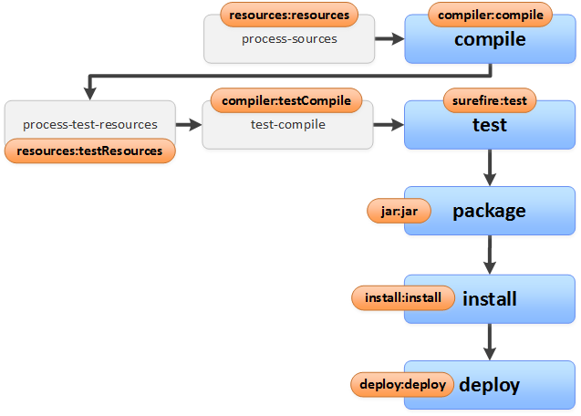  

Lectura complementaria:
[Ciclo de Construcción de Maven](!https://maven.apache.org/guides/introduction/introduction-to-the-lifecycle.html)

## El archivo `pom.xml`

La estructura básica de un proyecto Maven en Java sigue una convención estándar. Aquí un ejemplo de esta estructura de directorios:

``` tree
hola-mundo/
├── src/
│   ├── main/
│   │   ├── java/
│   │   └── resources/
│   └── test/
│       ├── java/
│       └── resources/
└── pom.xml
```

Dónde:
- `src/main/java`: Contiene el código fuente principal de la aplicación.
- `src/main/resources`: Contiene recursos (archivos de configuración, archivos de propiedades, etc.) utilizados en la aplicación principal.
- `src/test/java`: Contiene las pruebas unitarias y de integración.
- `src/test/resources`: Contiene recursos utilizados en las pruebas.

Además de los directorios podemos observar el archivo `pom.xml` que venimos nombrando desde el comienzo de las presentes notas de clase y ahora toca revisar en detalle.

El archivo pom.xml (Project Object Model) es el corazón de un proyecto de Maven. Es un archivo de texto en formato XML ([Extensible Markup Language](!https://es.wikipedia.org/wiki/Extensible_Markup_Language)) que contiene la configuración del proyecto y a partir del cual con solo disponer del directorio de proyecto con los archivos de código y este archivo, el proyecto puede ser abierto y trabajado en cualquier IDE que admita el trabajo con proyecto Maven. Aquí están los elementos clave del `pom.xml` y su explicación:

``` xml
<project>
    <modelVersion>4.0.0</modelVersion>
    <groupId>ar.edu.utnfc.backend</groupId>
    <artifactId>hola-mundo</artifactId>
    <version>1.0.0-SNAPSHOT</version>
    <name>Hola Mundo Maven</name>
    <description>A simple Maven project</description>
    
    <!-- Especificación de la versión de Java -->
    <properties>
        <maven.compiler.source>21</maven.compiler.source>
        <maven.compiler.target>21</maven.compiler.target>
    </properties>

    <dependencies>
        <!-- Dependencias del proyecto -->
    </dependencies>

    <build>
        <plugins>
            <!-- Plugin de compilación -->
            <plugin>
                <groupId>org.apache.maven.plugins</groupId>
                <artifactId>maven-compiler-plugin</artifactId>
                <version>3.8.1</version>
                <configuration>
                    <source>${maven.compiler.source}</source>
                    <target>${maven.compiler.target}</target>
                </configuration>
            </plugin>

            <!-- Otros plugins de construcción -->
        </plugins>
    </build>
</project>
```

- `<modelVersion>`: Versión del modelo del proyecto de Maven (normalmente 4.0.0).
-`<groupId>`: Identificador del grupo al que pertenece el proyecto (usualmente el dominio de la empresa al revés).
- `<artifactId>`: Identificador único del artefacto (nombre del proyecto).
- `<version>`: Versión del artefacto.
- `<name>`: Nombre descriptivo del proyecto.
- `<description>`: Descripción del proyecto.
- `<dependencies>`: Sección donde se declaran las dependencias del proyecto.
- `<properties>`: Este bloque permite definir propiedades utilizadas en el proyecto. Aquí, se establece la versión de Java para la compilación y ejecución del proyecto. En este ejemplo, se utiliza Java 8.
- `<build>`: Este bloque contiene la configuración para la construcción del proyecto.
  - `<plugins>`: Aquí se definen los plugins de construcción que se utilizarán en el ciclo de construcción del proyecto.
    - `<plugin>`: Cada plugin de construcción se define dentro de este elemento.
      - `<groupId>`: Identificador del grupo del plugin.
      - `<artifactId>`: Identificador del artefacto del plugin.
      - `<version>`: Versión del plugin.
      -`<configuration>`: Permite configurar opciones específicas del plugin. En este caso, se configura el plugin maven-compiler-plugin para que utilice la versión de Java definida en las propiedades.

Otros elementos opcionales: Puedes configurar repositorios, perfiles o credenciales de acuerdo con lo necesario para el proyecto.

Lecturas Complementarias:

- [Configuración del Compilador en POM](!https://maven.apache.org/plugins/maven-compiler-plugin/examples/set-compiler-source-and-target.html)
- [Plugins de Construcción en POM](!https://maven.apache.org/guides/introduction/introduction-to-plugins.html)
- [Configuración del Ciclo de Construcción en POM](!https://maven.apache.org/guides/introduction/introduction-to-the-lifecycle.html)

## Instalación de Maven

### Instalación de Maven en Windows

1. **Descarga Maven**:

   - Ve al sitio oficial de Apache Maven: https://maven.apache.org/download.cgi
   - Descarga el archivo ZIP de la última versión de Maven. La versión actual es la versión 3.9.10, sin embargo cualquier versión posterior a la versión 3.8.3 es apta para trabajar con Java 21. Aquí queda explicado el proceso con la versión 3.9.4 con la que se documentó en 2023.
   - Extrae el contenido del archivo ZIP en una ubicación conveniente, el lugar ideal de instalación depende del sistema operativo utilizado, pero lo recomendable es ubicarlo en un directorio que no requiera elevación de permisos para ser utilizado, por ejemplo, el directorio de archivos del usuario `c:\Users\miUsuario\tools\maven-3.9.4`.

2. **Configuración de Variables de Entorno**:

   - Abre el menú de Inicio y busca "Editar las variables de entorno del sistema".
   - En la pestaña "Opciones avanzadas", haz clic en "Variables de entorno".
   - En "Variables del sistema", crea una nueva variable con el nombre `M2_HOME` y el valor de la ruta a la carpeta donde extrajiste Maven (por ejemplo, `c:\Users\miUsuario\tools\maven-3.9.4`).
   - Edita la variable Path y agrega `%M2_HOME%\bin` al final.

### Instalación de Maven en Linux o Mac OS

1. **Descarga Maven**:

    - Abre una terminal.
    - Navegar hasta el directorio donde vayamos a instalar Maven, una alternativa sería /opt pero requeriría ser sudoer del sistema operativo, otra alternativa sigue siendo el directorio del usuario
    - Ejecuta el siguiente comando para descargar el archivo tar.gz de la última versión de Maven:

    ``` sh
    wget https://apache.claz.org/maven/maven-3/3.9.4/binaries/apache-maven-3.9.4-bin.tar.gz
    ```

2. **Descomprimir el archivo**:

    - Ejecuta el siguiente comando.
    - Ejecuta el siguiente comando para descargar el archivo tar.gz de la última versión de Maven:

    ``` sh
    tar -xf apache-maven-3.8.4-bin.tar.gz
    ```

3. **Configurar las variables de entorno**:

   - Abre el archivo .bashrc para bash shell en linux o .zshrc para z shell en macos con un editor de texto.
   - Agrega las siguientes líneas al final del archivo.

    ``` sh
    export M2_HOME=/opt/apache-maven-3.8.4
    export PATH=$PATH:$M2_HOME/bin
    ```

4. **Actualiza las variables de entorno**:

   - En la terminal, ejecuta:

    ``` sh
    source ~/.bashrc
    ```

    o

     ``` sh
    source ~/.zshrc
    ```

    Según tu sistema operativo para cargar los cambios de las variables de entorno.

### Verificación de la Instalación

Independientemente del mecanismo utilizado para verificar la instalación y configuración deberemos abrir una terminal o usar la terminal de la instalación y ejecutar:

``` sh
$ mvn --version
Apache Maven 3.9.4
Maven home: <raiz de instalación de maven>/maven-3.9.4
Java version: 17.0.6, ...

```

Si vemos aquí la versión de maven que hemos instalado es porque todo está funcionando Ok y si no lo vemos es porque algo no ha ido bien.

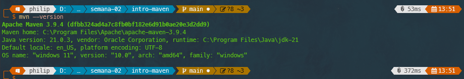  

### Ubicación del directorio .m2

Como veremos en el último apartado de estas notas de clase, la instalación de maven se completa con un directorio especial que es el directorio `.m2`

La ubicación del directorio .m2 (repositorio local) es la misma en todos los sistemas operativos. Por defecto, se encuentra en el directorio de usuario. Por ejemplo, en Windows, sería `C:\Users\miUsuario\.m2`, y en Linux o macOS, sería `/home/miUsuario/.m2`.

En el caso de requerir agregar alguna configuración específica o personalizada a maven el lugar para dicha configuración es un archivo llamado `settings.xml` ubicado directamente dentro de la carpeta `.m2`; sin embargo, maven funciona sin la necesidad de dicho archivo con la configuración por defecto.

Siguiendo estos pasos, habrás instalado y configurado correctamente la última versión de Maven en Windows, Linux y macOS, y estarás listo para comenzar a desarrollar proyectos con esta herramienta.

## Hola mundo con Maven

A continuación, nos proponemos retomar la tarea del apunte de clases anterior en el que creamos un programa "Hola Mundo Java" con su consecuente compilación y ejecución por línea de comandos, pero ahora utilizando la herramienta Maven para llevar a cabo la creación del proyecto y todas las tareas asociadas a la construcción y ejecución de dicho artefacto de software.

1. **Vamos a crear el proyecto**:

    - Ahora vamos a crear el proyecto y para ello vamos a utilizar un archetype.
    - En Maven Central existe un archetype predefinido para crear una aplicación java básica, el nombre de este archetype es: `maven-archetype-quickstart`
    - Creamos el proyecto utilizando la herramienta mvn

    ``` ps
    mvn archetype:generate "-DgroupId=ar.edu.utnfc.backend" `
    "-DartifactId=hola-mundo" `
    "-DarchetypeGroupId=org.apache.maven.archetypes" `
    "-DarchetypeArtifactId=maven-archetype-quickstart" `
    "-DinteractiveMode=false"

    ```

    > Nota: en Power Shell cada uno de los argumentos debe ser encerrado entre comillas dobles sino maven va a producir un error

    - También es posible utilizar la versión interactiva que nos irá preguntando cada uno de los parámetros que hemos comentado en el presente material.
    - Si todo funcionó Ok vamos a ver la siguiente salida:

    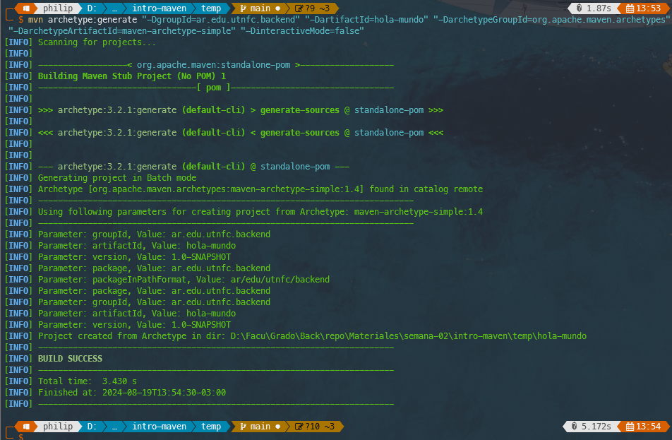  
  
2. **Revisamos lo creado por Maven**:

    - En primer lugar vamos a encontrar un directorio con el nombre del artefacto, en este ejemplo `hola-mundo`
    - y dentro de este directorio vamos a encontrar la siguiente estructura de directorios y archivos:

    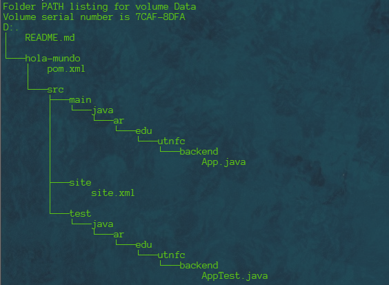  

    - Aquí hay varias cosas para revisar, en primer lugar el archivo `pom.xml` que se encuentra directamente en la raiz del directorio creado para el proyecto.
    - Luego la convención de los directorios `src` para archivos del proyecto y `test` para los archivos de las pruebas y un directorio `site` con un archivo de información del proyecto que es utilizada por el plugin `site` para crear un sitio asociado al proyecto (No vamos a usar dicho plugin en Backend).
    - Ahora bien, además del archivo `pom.xml` también vamos a encontrar dentro del directorio `main/java/<paquetes asociados al groupid>/` el archivo `App.java` que no es ni más ni menos que un "Hola Mundo" Similar al que hicimos de forma manual en el apunte de clases anterior.

    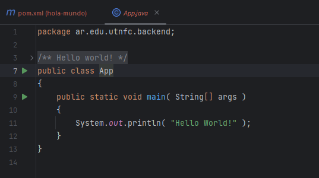  

    > Nota: los paquetes o `packages` en java son una estructura de directorios para organizar las clases asociada a la sentencia `package` que podemos observar en la primera línea de código del archivo .java.

    - Pero finalmente nos enfoquemos en el corazón del proyecto maven que es el archivo `pom.xml`

    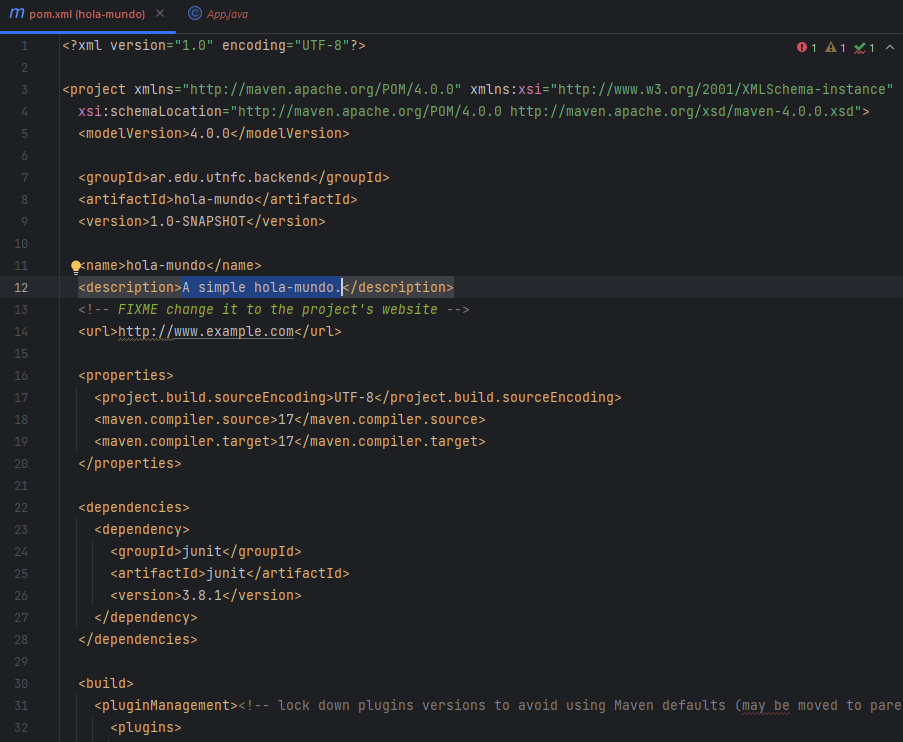  

    - Aquí podemos identificar los elementos de configuración del proyecto, como también la versión de Java y del código Fuente que por defecto es establecida a 1.7 y personalmente la cambié a 17. La dependencia de la librería JUnit de tests unitarios y en adelante la configuración de plugins para la construcción del proyecto.

3. **Bien ahora construyamos este _Hola Mundo_**

    - Para ello podemos abrir el directorio anterior con IntelliJ y utilizar la terminal del IDE o quedarnos en la terminal del sistema operativo.
    - Estando entonces dentro del directorio del proyecto vamos a ejecutar:

    ``` ps
    > mvn compile

    ```

    - Si todo fue bien vamos a observar una salida similar a esta:

    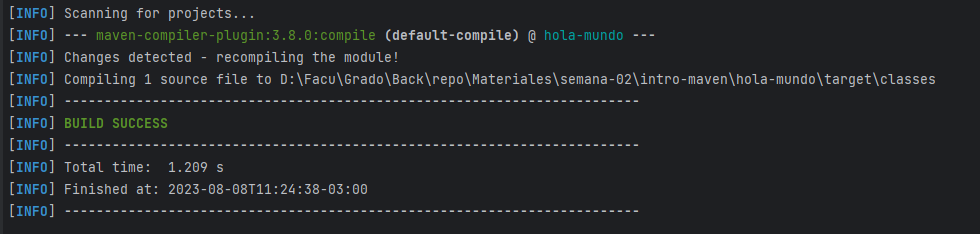  

    - Y como lo indica la propia salida la particularidad más visible es que aparece la carpeta target dentro del proyecto conteniendo el resultado de la compilación de todas las clases. De hecho, si buscamos en `target/classes/<paquetes asociados al groupid>/` vamos a encontrar el archivo `App.class` que podemos usar para ejecutar la aplicación como lo hicimos en el apunte de clases anterior.
    - Sin embargo, al trabajar con maven tenemos una manera más elegante de empaquetar y ejecutar nuestra aplicación java. Aunque, para lograrlo vamos a tener primero que agregar al archivo `pom.xml` la configuración que le indicará a Maven cuál es el archivo que tiene el método `main` y debe ser utilizado como punto de inicio de nuestra aplicación, que por ahora es lo único que tiene.
    - Para ello vamos a tener que modificar la configuración del plugin que lleva a cabo el empaquetado en el archivo .jar para indicarle que agregue el archivo `MANIFEST.MF` que esencialmente el que diferencia un archivo .jar que es solo una librería de un archivo .jar que es una aplicación que podemos ejecutar como veremos más adelante.
    - Para lograrlo vamos a ubicar el plugin encargado de generar el archivo .jar `<artifactId>maven-jar-plugin</artifactId>` y luego de la versión que ya tiene el archivo `pom.xml` especificada, agregamos lo siguiente (dicho plugin debe quedar como sigue):

    ``` pom.xml
        <plugin>
          <artifactId>maven-jar-plugin</artifactId>
          <version>3.0.2</version>
          <configuration>
            <archive>
              <manifest>
                <mainClass>ar.edu.utnfc.backend.App</mainClass>
              </manifest>
            </archive>
          </configuration>
        </plugin>
    ```

    - Una vez realizada esta configuración tenemos que construir el proyecto usando:

    ``` ps
    > mvn package

    ```

    - Si todo resulta Ok la salida será más o menos así:

    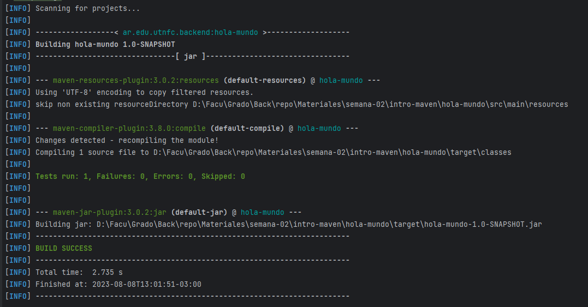  

    - Ahora el directorio `target` contiene el archivo `hola-mundo-1.0-SNAPSHOT.jar` que corresponde con el nombre del artefacto más la versión con la extensión .jar
    - Si abrimos este archivo con una herramienta para descomprimir archivos dentro vamos a encontrar el mencionado archivo `MANIFEST.MF` que indica el punto de inicio de la aplicación

    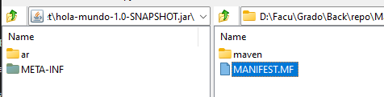  

    - Con el texto indicando la clase main, como se puede observar:

    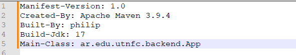  

4. **Ejecutando nuestra aplicación**

    - Ahora tenemos un componente Java ejecutable...
    - Como sabemos, y ya hemos comentado en el apunte de clases anterior, no se puede generar código ejecutable con Java sino que lo que tenemos en el conjunto de archivos .class, empaquetado junto con su configuración de manera tal de poder transportar y contener todo lo necesario en un solo archivo, eso es un archivo .jar por Java Archive.
    - Para ejecutar un archivo .jar vamos a usar la máquina virtual java como lo hicimos en el apunte de clases anterior pero le vamos a agregar el parámetro `-jar` para indicarle que lo que le estamos dando como entrada es un empaquetado de una aplicación java.
    - Entonces, para ejecutar usamos la línea de comandos:

    ``` ps
    > java -jar hola-mundo-1.0-SNAPSHOT.jar

    ```

    - Y allí finalmente tenemos nuestra aplicación ejecutando.

    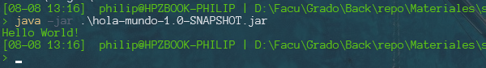  

### Alternativa de ejecución utilizando el propio administrador `mvn`

_**¿Por qué y cómo se puede ejecutar una aplicación Java con mvn?**_

**Maven como orquestador de tareas**  
Maven no es un compilador ni un intérprete. Es un framework de automatización del ciclo de vida de un proyecto Java (y de otros lenguajes, aunque su ecosistema está centrado en Java). Sus tareas no son ejecutadas por él mismo, sino por plugins, que son componentes específicos que saben hacer una acción: compilar, testear, empaquetar, etc.

Cuando ejecutás un comando como:`  

```bash
mvn compile

```

Maven no llama directamente a `javac`, sino que invoca al maven-compiler-plugin, que tiene configurado cómo y con qué parámetros debe invocar `javac`.

De la misma manera, para ejecutar tenemos la alternativa:

```bash
mvn exec:java

```

Que no ejecuta directamente java, sino que invoca al `plugin exec-maven-plugin`, el cual ejecuta un comando Java real bajo ciertas configuraciones (como qué clase tiene el método main y qué classpath usar).

Este plugin debe ser referenciado y configurado en el archivo `pom.xml` por ejemplo para el ejemplo del archetype `maven-archetype-quickstart` deberíamos agregar al archivo `pom.xml` lo siguiente:  
Agregar dentro de `<build><plugins>`:

```xml
...

<plugin>
  <groupId>org.codehaus.mojo</groupId>
  <artifactId>exec-maven-plugin</artifactId>
  <version>3.1.0</version>
  <configuration>
    <mainClass>ar.edu.utnfc.backend.App</mainClass>
  </configuration>
</plugin>

...

```

### 🚀 ¿Por qué esto es más que un atajo?

Usar `mvn exec:java` tiene ventajas claras:

- ✅ 1. Usa el classpath resuelto por Maven
Ejecuta el programa con todas las dependencias descargadas correctamente.
No necesitás escribir ni construir manualmente un classpath.

- ✅ 2. Se integra con el ciclo de vida
    Podés decir: mvn clean compile exec:java y asegurarte de compilar desde cero.
    En proyectos grandes, esto se vuelve un flujo confiable.

- ✅ 3. Funciona igual para proyectos simples o complejos (como Spring Boot)
    Spring Boot usa spring-boot-maven-plugin, que extiende el ciclo con un spring-boot:run, que hace lo mismo: resuelve dependencias, configura classpath y ejecuta.

🧰 Entonces, ¿cuándo y por qué usar mvn exec:java?

- Durante el desarrollo, para correr aplicaciones pequeñas, sin necesidad de construir .jar.  
- Para scripts que se ejecutan en etapas de CI/CD sin necesidad de empaquetado.  
- Para proyectos educativos o pruebas, donde se quiere evitar fricción con la terminal y comandos manuales.  
- Porque es consistente con todo el ciclo Maven: dependencias, compilación, plugins, etc.

## Repositorios de dependencias

Para cerrar el presente Apunte de Clases, no podemos pasar por alto una breve descripción del concepto de repositorio y las diferencias entre los diferentes repositorios con los que interactúa maven durante el ciclo de vida del proyecto.

Por ello en primer lugar tenemos Maven Central o repositorio central global de maven, además de otros repositorios globales de dependencias especificas que podemos configurar. Luego tenemos los repositorios privados o propios, esto es instalar el software del repositorio como por ejemplo Nexus en los servidores de nuestra organización para compartir allí los componentes de los distintos equipos de trabajo de la organización y finalmente, el repositorio local o también llamado cache que es esencialmente la carpeta .m2 de la instalación local de maven.

1. **Repositorio Central**:
El repositorio central es un repositorio de dependencias mantenido por la comunidad Maven. Es el repositorio predeterminado desde el cual Maven descarga dependencias cuando las declaras en tu archivo pom.xml. El repositorio central almacena una gran cantidad de bibliotecas y artefactos Java de uso común, lo que facilita la incorporación de estas dependencias en tus proyectos sin necesidad de descargarlas manualmente.

2. **Repositorio Remoto**:
Un repositorio remoto es un servidor que almacena dependencias y artefactos de proyectos. Puedes configurar Maven para usar repositorios remotos adicionales además del repositorio central. Esto es útil cuando trabajas con bibliotecas específicas o en entornos con restricciones de red. Maven descarga dependencias desde repositorios remotos según sea necesario y las almacena en tu repositorio local para su reutilización. Para lograr que maven acceda a repositorios remotos específicos será necesario configurar el acceso a dichos repositorios o bien en el archivo `pom.xml` para un proyecto en particular o bien en el archivo `settings.xml` para todos los proyectos en mi pc.

3. **Repositorio Local o Cache**:
El repositorio local es un directorio en tu sistema donde Maven almacena las dependencias descargadas. Por defecto, este repositorio está ubicado en la carpeta .m2 en tu directorio de usuario. Cuando Maven descarga una dependencia por primera vez desde un repositorio remoto, la almacena en el repositorio local. Esto evita tener que descargar la misma dependencia nuevamente en el futuro y permite trabajar sin conexión a Internet.

### Comparación con la Carpeta Local .m2: Repositorio Local y Caché de Dependencias Remotas

El directorio .m2 en tu sistema actúa como el repositorio local y también como una caché de dependencias remotas descargadas. Aquí hay una comparación detallada de su papel:

Repositorio Local (.m2):

- Almacena todas las dependencias descargadas en tu sistema.
- Evita descargas repetidas al permitir que Maven reutilice dependencias ya descargadas.
- Facilita la construcción de proyectos en entornos sin acceso a Internet al proporcionar dependencias previamente descargadas.
- Permite la colaboración en equipos, ya que todos los miembros del equipo pueden utilizar las mismas dependencias almacenadas localmente.

Caché de Dependencias Remotas:

- Actúa como una caché temporal de dependencias descargadas desde repositorios remotos.
- Cuando Maven necesita una dependencia, primero verifica si está en la caché local antes de intentar descargarla nuevamente.
- Optimiza el rendimiento al reducir la necesidad de descargar repetidamente las mismas dependencias desde repositorios remotos.

Lectura complementaria:
[Repositorios en Maven](!https://maven.apache.org/guides/introduction/introduction-to-repositories.html)

En resumen, los repositorios de dependencias (central, remoto y local) y la carpeta local .m2 desempeñan un papel crucial en la gestión y distribución eficiente de las dependencias en proyectos Maven. Estos conceptos son fundamentales para garantizar que tus proyectos tengan acceso a las bibliotecas necesarias y funcionen de manera confiable en diferentes entornos de desarrollo.

## Ciclo de Vida de Construcción en Maven

A modo de Resumen, agregamos aquí una tabla con los distintos pasos del ciclo de vida de la administración de proyectos con Maven:

| Fase        | Descripción                                                                 |
|-------------|------------------------------------------------------------------------------|
| `validate`  | Verifica que el proyecto está bien estructurado y toda la información es válida. |
| `compile`   | Compila el código fuente del proyecto.                                       |
| `test`      | Ejecuta las pruebas unitarias utilizando un marco de pruebas como JUnit.    |
| `package`   | Empaqueta el código compilado en un formato distribuible, como `.jar` o `.war`. |
| `verify`    | Ejecuta cualquier verificación necesaria sobre el resultado del empaquetado. |
| `install`   | Instala el artefacto en el repositorio local (`.m2`) para ser usado por otros proyectos. |
| `deploy`    | Copia el artefacto final a un repositorio remoto para compartirlo con otros desarrolladores. |

## 🧩 Anexo 1: Incluir dependencias dentro del .jar (Fat JAR o Uber JAR)

El `.jar` que genera Maven por defecto incluye solo las clases propias del proyecto. Si el programa requiere bibliotecas externas (como JUnit, Gson, etc.), al ejecutar con `java -jar` puede fallar con errores de clase no encontrada.

Para evitar esto, podemos generar un `.jar` **con todas las dependencias incluidas**, usando el plugin `maven-assembly-plugin`. Esto se conoce como **Fat JAR** o **Uber JAR**.

### Configuración en el `pom.xml`

Agregar dentro de `<build><plugins>`:

```xml
<plugin>
  <artifactId>maven-assembly-plugin</artifactId>
  <version>3.3.0</version>
  <configuration>
    <archive>
      <manifest>
        <mainClass>ar.edu.utnfc.backend.App</mainClass>
      </manifest>
    </archive>
    <descriptorRefs>
      <descriptorRef>jar-with-dependencies</descriptorRef>
    </descriptorRefs>
  </configuration>
  <executions>
    <execution>
      <id>make-assembly</id>
      <phase>package</phase>
      <goals>
        <goal>single</goal>
      </goals>
    </execution>
  </executions>
</plugin>

```

### Entonces, ¿Qué es un Uber Jar (o Fat Jar) y qué produce exactamente?

Cuando hablamos de construir un Uber Jar con Maven, nos referimos a generar un archivo .jar autocontenido, que incluye:

✅ Las clases compiladas del proyecto (las tuyas, en src/main/java)
✅ Los recursos del proyecto (archivos en src/main/resources)
✅ Y lo más importante: TODAS las dependencias que el proyecto necesita para ejecutarse (archivos .jar descargados por Maven)

Todo eso se empaqueta en un solo .jar ejecutable, que puede correrse sin necesitar nada más instalado o configurado (más allá de tener Java).

#### 📦 ¿Qué hace Maven por defecto al ejecutar mvn package?

Sin configuración adicional:

- Toma tus .class compilados
- Los empaqueta en un archivo .jar
- Crea un archivo target/mi-proyecto-1.0.jar

Pero no incluye las dependencias. Si usás bibliotecas externas (como Gson, JUnit, Apache Commons, etc.), ese .jar fallará si las clases no están disponibles en el classpath cuando lo ejecutes.

#### 💡 ¿Qué hace un Uber Jar que no hace un .jar normal?

Con un plugin como maven-assembly-plugin, Maven:

1. Combina tu código con las dependencias:
   - Descomprime cada .jar de dependencia
   - Extrae sus clases y recursos
   - Los mete dentro de tu .jar

2. Agrega un archivo especial META-INF/MANIFEST.MF que declara:

    ```text
    Main-Class: ar.edu.utnfc.backend.App
    ```

    > Esto le dice a java cuál es la clase de inicio al ejecutar el jar

3. Genera un .jar nuevo con sufijo -jar-with-dependencies:

    Ejemplo: target/hola-mundo-1.0-SNAPSHOT-jar-with-dependencies.jar
    Este nuevo .jar puede ejecutarse directamente como lo vimos anteriormente al agregar las configuración del `jar-plugin`:

    ```bash
    java -jar target/hola-mundo-1.0-SNAPSHOT-jar-with-dependencies.jar
    ```

    Y se ejecutará correctamente incluso si no tenés ninguna dependencia instalada en tu sistema ni configuraste ningún classpath.

En este punto con proyectos sin demasiadas dependencias no es algo que se vuelva crítico ni necesario pero más adelante cuando los proyectos dependan de las dependencias requeridas va a ser esencial.

#### 🧰 ¿Cómo lo logra? (detalle técnico básico)

Internamente, un .jar es solo un archivo .zip con clases y un manifiesto. Cuando hacés un Uber Jar, Maven toma:

- target/classes/... → tu código compilado
- dependency.jar!/com/ejemplo/... → el contenido de cada .jar de dependencia
- Los fusiona en un único archivo .jar
- Y asegura que haya un único META-INF/MANIFEST.MF válido

#### 🎯 ¿Por qué usar un Uber Jar?

| Caso de uso                                                  | Beneficio                                       |
|--------------------------------------------------------------|-------------------------------------------------|
| Ejecutar en otra máquina sin necesidad de Maven instalado    | ✅ El `.jar` ya contiene todo lo necesario       |
| Desplegar una app sencilla (CLI, microservicio, tarea batch) | ✅ Portabilidad absoluta y ejecución directa     |
| Evitar conflictos de classpath en entornos complejos         | ✅ Las versiones ya están resueltas y empaquetadas |
| Aprender cómo funciona una app Java real                     | ✅ Claridad total sobre clases, dependencias y ejecución |

## 🚀 ¿Y después qué? Introducción a `mvn deploy` y repositorios remotos

Hasta ahora vimos cómo usar Maven para compilar, testear y empaquetar un proyecto localmente. Pero, ¿qué pasa cuando necesitamos **compartir ese artefacto (`.jar`) con otros equipos o proyectos**?

Ahí entra en juego la acción `deploy`.

### ¿Qué es `mvn deploy`?

El comando `mvn deploy` es el paso final del ciclo de vida de Maven. Sirve para **subir (desplegar) el artefacto generado** a un **repositorio remoto**, desde donde otros proyectos pueden descargarlo como dependencia.

```bash
mvn deploy
```

> Esto solo tiene sentido cuando se configura un repositorio remoto accesible por Maven (por ejemplo, un servidor privado de la organización).

### ¿Qué es un repositorio remoto?

Un **repositorio Maven remoto** es un servidor especializado que almacena artefactos Java (como `.jar`, `.war`, `.pom`, etc.) y los organiza por `groupId`, `artifactId` y `version`.

Los proyectos Maven pueden **publicar artefactos** en estos repositorios y **consumir artefactos** de ellos como dependencias.

### 👷️ Software popular para repositorios remotos

- **Nexus Repository Manager** (de Sonatype)  
  Muy utilizado en empresas, gratuito en su versión OSS.
  
- **JFrog Artifactory**  
  Profesional, muy completo, con versión gratuita.

- **Apache Archiva**  
  Alternativa open-source más simple.

- **GitLab Package Registry**  
  Permite subir artefactos `.jar` a proyectos GitLab, integrando la gestión de dependencias con el control de versiones y CI/CD. Compatible con Maven mediante configuración del `pom.xml` y `settings.xml`.

### ↻ ¿Cómo se usa `deploy`?

Para desplegar tu `.jar` al repositorio remoto necesitás:

1. Un `pom.xml` con información del servidor remoto (`<distributionManagement>`)
2. Configurar las credenciales en el archivo `~/.m2/settings.xml`
3. Un servidor como Nexus/Artifactory ejecutándose
4. Ejecutar:

```bash
mvn deploy
```

> Maven empaqueta y sube tu artefacto al servidor remoto, junto con su `pom.xml` y metadatos.

### ¿Por qué es importante esto?

| Caso de uso                                | Beneficio                                        |
|--------------------------------------------|--------------------------------------------------|
| Compartir librerías internas entre equipos | ✅ Centralización, control de versiones, reutilización |
| Automatizar pipelines CI/CD                | ✅ Build + deploy automático desde Jenkins, GitLab CI, etc. |
| Versionar y publicar tus artefactos        | ✅ Historial de builds accesibles y trazables    |

> Esta es una **punta de ovillo 🧶**: no lo vamos a usar en la materia, pero dejamos el concepto para completar el ciclo y articular cómo encaja en proyectos reales de desarrollo profesional.
