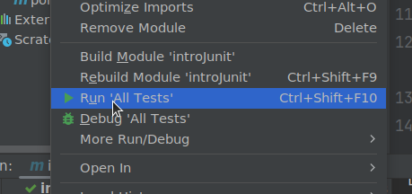
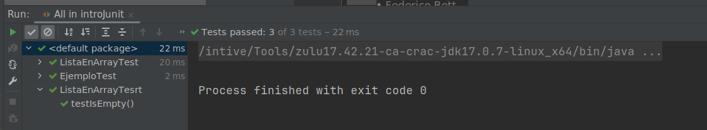
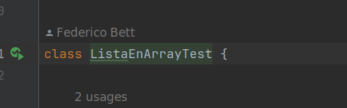

# Apunte 7 - Testing

## Introducción General

Una vez desarrollada una parte de un programa, o a veces inclusive antes del desarrollo, llega el momento de verificar que todo funciona como se supone que debería funcionar. Para ello se realizan una serie de pruebas, donde el programador ejecuta una parte del programa, conociendo de antemano los resultados que deberían darse y verifica que efectivamente se estén entregando esos resultados. Estas pruebas de partes del programa se conocen como pruebas unitarias, o tests unitarios.

Si bien esto puede hacerse en forma manual para programas chicos, llega el punto en el que uno quiere automatizar dichos tests, para poder ejecutarlos múltiples veces al ir haciendo cambios al programa. Eso garantiza, o ayuda a evitar que de forma accidental el programador introduzca un cambio que termine rompiendo o modificando la funcionalidad existente de forma no esperada.

El ecosistema Java posee varias herramientas pensadas para realizar este tipo de tests, y la mas común es la utilización de una librería llamada *JUnit*. Dicha librería nos provee una serie de anotaciones y clases que uno puede usar para generar las pruebas unitarias. Esta librería fue una de las primeras dedicadas a la automatización de pruebas, y fue creada por dos proponentes del uso de testing automatizado como son *Kent Beck* y *Erich Gamma*.

Una vez creados los casos de prueba estos se pueden ejecutar desde el propio entorno de desarrollo, sea IntelliJ u otro, ya que casi todos tienen soporte para la ejecución de pruebas unitarias. Además se pueden correr desde el propio *Maven* como parte del proceso de empaquetado del programa.

## Introducción a JUnit

JUnit es una librería que nos provee herramientas para la ejecución y creación de pruebas unitarias. Esta librería es una de las mas usadas para la generación de pruebas unitarias y actualmente se encuentra en la versión 5 (Al momento de escribir esto la versión 5.10)

Particularmente la versión 5 de JUnit se compone de tres componentes:

- *JUnit Platform*: Que es la plataforma que permite el descubrimiento y ejecución de las pruebas unitarias. Esta plataforma se encuentra integrada en casi todos los IDE de java y en las herramientas de construcción como *Maven* o *Gradle*
- *JUnit Jupiter*: Es un modelo de programación que nos permite escribir los tests y provee una serie de anotaciones y extensiones que ayudan a la escritura de los tests.
- *JUnit Vintage*: Es una capa de compatibilidad para poder seguir usando tests escritos para JUnit4 en proyectos que usan JUnit 5.

Para el caso de un proyecto que arranque con JUnit 5 no es necesario usar el JUnit Vintage, y la mayor parte del esfuerzo se va a centrar en la escritura de los tests usando el Junit Jupiter, que no es mas que un conjunto de anotaciones y clases a usar al momento de escribir una prueba unitaria.

## Como importar JUnit en un proyecto Maven

Para poder utilizar JUnit en un proyecto maven, basta con agregar una dependencia al artefacto con groupId *org.junit.jupiter* y artifactId *junit.jupiter*. En general al referirse a una dependencia de maven se suele usar la forma groupId:artifactId, o sea para este caso la dependencia necesaria sería *org.junit.jupiter:junit.jupiter*

Dicha dependencia se agrega en la sección *\<dependencies>* del archivo pom.xml de la siguiente forma:

```xml
    <dependencies>
        <dependency>
            <groupId>org.junit.jupiter</groupId>
            <artifactId>junit-jupiter</artifactId>
            <version>5.10.0</version>
            <scope>test</scope>
        </dependency>
    </dependencies>
```

Agregando esta dependencia se agrega transitivamente la dependencia de junit-engine necesaria para la ejecución de los tests.

Nótese la inclusión del tag **scope** dentro de la definición de la dependencia. Esto le indica a Maven que esta dependencia será usada durante el proceso de testing, pero no será incluida dentro del artefacto generado en el packaging del proyecto.

## Creación de un unit test

Lo primero que hay que ver al momento de crear un unit test, es donde se deben ubicar los archivos del test. Por convención de Maven, dentro de la carpeta src hay dos carpetas, **main** y **test**. La carpeta main es donde van a estar todos los archivos de código fuente que forman parte del código de producción, o sea el que se va a terminar empaquetando con el proyecto. La carpeta test está para que en ella se ubiquen todos los test unitarios, estos fuentes sólo se compilan durante la ejecución de los tests, pero no forman parte del producto.

Dentro de JUnit un unit test es básicamente un método anotado con la anotación **@Test**, y los tests se agrupan en Suites, que son clases cuyo nombre generalmente termina en *Test* y contienen uno o más métodos anotados con la anotación **@Test**.

```java
public class EjemploTest {
    
    public int suma(int a, int b) {
        return a+b;
    }
    
    @Test
    public void testSuma() {
        int suma = suma(1, 3);
        Assertions.assertEquals(4, suma);
    }
    
}
```

En el ejemplo previo, el método testSuma va a invocar al método suma y comprobar el resultado devuelto por la función suma contra un valor esperado.

Además de @Test hay varias anotaciones mas que se pueden usar para marcar métodos, algunas de ellas son:

- **@BeforeEach**: Marca un método que se va a ejecutar antes de la ejecución de cada uno de los tests de la suite
- **@BeforeAll**:Marca un método que se va a ejecutar antes de la ejecución de todos los tests de la suite (sólo se ejecuta una vez por suite)
- **@AfterEach**: Análogo a BeforeEach, pero se ejecuta luego de cada test
- **@AfterAll**: Igualmente análogo a BeforeAll, sólo se va a ejecutar una vez al terminar de ejecutar todos los tests de la suite
- **@Disabled**: Permite desactivar un test, para que no se ejecute
- **@Timeout**: Permite establecer un tiempo máximo de ejecución para un test, si este tiempo se excede el test falla.

## Comprobaciones

Dentro de un test, se espera que además de ejecutar algo y ver que no se produzcan excepciones, se compruebe que los resultados provistos por el código sean los correctos. Esto se hace mediante comprobaciones, conocidas como *assertions*. Si la comprobación es correcta, sigue la ejecución, pero si no es correcta se interrumpe la ejecución del test con un error.

Dentro de JUnit 5 las comprobaciones están dentro de la clase Assertions. Algunos de los métodos provistos por esta clase son:

- **assertTrue(boolean)***: Comprueba que el boolean sea true, o falla
- **assertTrue(boolean, mensaje)**: Comprueba que el boolean sea true o falla informando el mensaje indicado
- **assertFalse(boolean)**: Comprueba que el boolean sea false, o falla
- **assertFalse(boolean, mensaje)**: Comprueba que el boolean sea false o falla informando el mensaje indicado
- **assertEquals(esperado, valor)**: Comprueba que valor sea igual a esperado o falla. Este método tiene muchas variantes con diferentes tipos, notable de destacar es la variante de float que admite un tercer parámetro indicando un delta que tiene que superarse para que se considere que los valores no son iguales.
- **assertEquals(esperado, valor, mensaje)**: Igual que el anterior, pero agregando el mensaje a mostrar en caso de falla.
- **assertNotEquals(esperado, valor)**: Contrario a assertEquals
- **assertNotEquals(esperado, valor, mensaje)**: Contrario a assertEquals
- fail()**: hace fallar el test
- fail(mensaje)**: hace fallar el test informando un mensaje
- **assertThows(clase, ejecutable)**: Comprueba que el código ejecutado en *ejecutable*, que es una interfaz funcional donde se puede usar un lambda, lance una Exception del tipo *clase*
- **assertDoesNotThrow(ejecutable)**: Comprueba que el código ejecutado en *ejecutable* NO lance una exception.

Todos los métodos definidos en Assertions son estáticos, con lo cual se pueden usar de la forma *Assertions.assertEquals(a, b)*, o también se suele hacer de forma habitual un import static para que todos los métodos assert estén disponibles para llamar directamente.

```java
import static org.junit.jupiter.api.Assertions.assertTrue;
```

Haciendo este import se puede usar por ejemplo *assertEquals* como si estuviera definida dentro del test.

## Ejecución de tests

Para ejecutar los tests desde IntelliJ la forma mas simple es mediante el uso del botón derecho sobre el arbol de proyecto, y seleccionando la opción **Run 'All Tests'**



Esto va a ejecutar todas las suites de tests presentes en el proyecto y luego se va a mostrar el resultado de dicha ejecución, marcando los test que se ejecutaron exitosamente y los que no.



Alternativamente se puede ejecutar una sola suite de test, o un test individual haciendo click en la flecha verde que presenta IntelliJ al abrir el código de dicha suite de test.



Otra forma de ejecutar los tests, es mediante el uso de maven. Dentro de los diferentes pasos del ciclo de vida que provee maven, existe uno llamado **test** que se puede invocar para ejecutar los test

Este paso del ciclo de vida también se termina ejecutando al realizar otras acciones con maven como pueden ser **deploy**, **package** o **install**.

```cmd
18:50 $ mvn test
[INFO] Scanning for projects...
[INFO] 
[INFO] -------------------< ar.edu.utn.frc.bso:introJunit >--------------------
[INFO] Building introJunit 1.0-SNAPSHOT
[INFO]   from pom.xml
[INFO] --------------------------------[ jar ]---------------------------------
[INFO] 
[INFO] --- resources:3.3.0:resources (default-resources) @ introJunit ---
[INFO] Copying 0 resource
[INFO] 
[INFO] --- compiler:3.10.1:compile (default-compile) @ introJunit ---
[INFO] Nothing to compile - all classes are up to date
[INFO] 
[INFO] --- resources:3.3.0:testResources (default-testResources) @ introJunit ---
[INFO] skip non existing resourceDirectory /home/fbett/UTN/2023/Backend/material/semana-07/testing/introJunit/introJunit/src/test/resources
[INFO] 
[INFO] --- compiler:3.10.1:testCompile (default-testCompile) @ introJunit ---
[INFO] Nothing to compile - all classes are up to date
[INFO] 
[INFO] --- surefire:3.0.0:test (default-test) @ introJunit ---
[INFO] Using auto detected provider org.apache.maven.surefire.junitplatform.JUnitPlatformProvider
[INFO] 
[INFO] -------------------------------------------------------
[INFO]  T E S T S
[INFO] -------------------------------------------------------
[INFO] Running ar.edu.utn.frc.bso.EjemploTest
[INFO] Tests run: 1, Failures: 0, Errors: 0, Skipped: 0, Time elapsed: 0.043 s - in ar.edu.utn.frc.bso.EjemploTest
[INFO] Running ar.edu.utn.frc.bso.ListaEnArrayTest
[INFO] Tests run: 1, Failures: 0, Errors: 0, Skipped: 0, Time elapsed: 0.006 s - in ar.edu.utn.frc.bso.ListaEnArrayTest
[INFO] 
[INFO] Results:
[INFO] 
[INFO] Tests run: 2, Failures: 0, Errors: 0, Skipped: 0
[INFO] 
[INFO] ------------------------------------------------------------------------
[INFO] BUILD SUCCESS
[INFO] ------------------------------------------------------------------------
[INFO] Total time:  1.300 s
[INFO] Finished at: 2023-10-01T18:50:48-03:00
[INFO] ------------------------------------------------------------------------
[WARNING] 
[WARNING] Plugin validation issues were detected in 2 plugin(s)
[WARNING] 
[WARNING]  * org.apache.maven.plugins:maven-compiler-plugin:3.10.1
[WARNING]  * org.apache.maven.plugins:maven-resources-plugin:3.3.0
[WARNING] 
[WARNING] For more or less details, use 'maven.plugin.validation' property with one of the values (case insensitive): [BRIEF, DEFAULT, VERBOSE]
[WARNING] 

```

## Mocking

Durante el desarrollo de pruebas unitarias, es normal que en algún punto tengamos que hacer que algún objeto devuelva un valor predefinido, esperado por el test.

Por ejemplo, al hacer tests a un servicio que usa un repositorio, va a ser necesario, para poder probar algunas cosas, hacer que ese repositorio devuelva cierto valor en concreto. Esto se logra implementando una versión del repositorio que devuelve valores fijos, o configurables, y usando dicha versión al instanciar el servicio en el test.

Por ejemplo dado este servicio de ejemplo:

```java
package ar.edu.utn.frc.bso;

import java.util.List;
import java.util.Optional;

public class ServicioAlumnos {

    private RepositorioAlumnos repositorio;

    public ServicioAlumnos(RepositorioAlumnos repositorio) {
        this.repositorio = repositorio;
    }

    public Alumno obtenerAlumno(int legajo) {
        List<Alumno> lista = repositorio.listar();
        for(Alumno a: lista) {
            if (a.getLegajo() == legajo) {
                return a;
            }
        }
        return null;
    }
}
```

Uno podría intentar hacer dos tests para el método *obtenerAlumno*. Uno podría probar el caso en el que se encuentra el alumno, y uno el caso de que no se encuentre. Entonces, para ello se podría hacer una clase que herede de *RepositorioAlumnos* y agregar métodos para definir la lista de alumnos a devolver, para que cada test defina de antemano lo que debería devolver la llamada a listar() del repositorio.

Esto quedaría así:

```java
package ar.edu.utn.frc.bso;

import org.junit.jupiter.api.Assertions;
import org.junit.jupiter.api.BeforeEach;
import org.junit.jupiter.api.Test;

import java.util.List;

import static org.junit.jupiter.api.Assertions.*;


class RepositorioTest extends RepositorioAlumnos {
    private List<Alumno> listaADevolver;

    public void setListaADevolver(List<Alumno> l) {
        this.listaADevolver = l;
    }

    @Override
    public List<Alumno> listar() {
        return listaADevolver;
    }
}
public class ServicioAlumnosTest {

    private ServicioAlumnos servicio;
    private RepositorioTest repositorioTest;

    @BeforeEach
    public void setup() {
        repositorioTest = new RepositorioTest();
        servicio = new ServicioAlumnos(repositorioTest);
    }

    @Test
    public void testAlumnoExistente() {
        Alumno alumnoEsperado = new Alumno("Pepe", 123);
        repositorioTest.setListaADevolver(List.of(alumnoEsperado));
        Alumno x = servicio.obtenerAlumno(123);
        Assertions.assertEquals(alumnoEsperado, x);
    }

    @Test
    public void testAlumnoNoExistente() {
        Alumno alumnoEsperado = new Alumno("Laura", 234);
        repositorioTest.setListaADevolver(List.of(alumnoEsperado));
        Alumno x = servicio.obtenerAlumno(123);
        Assertions.assertNull(x);
    }

}
```

La clase de test del repositorio hereda de la clase real (o implementa la interfaz si hubiera una), y permite establecer la lista de alumnos a devolver. Con esta funcionalidad cada test define la lista previamente a llamar al servicio, con lo cual se puede predecir que debería devolverse en cada caso.

## Proyectos de Ejemplo

- [IntroJunit](./introJunit/) Proyecto con ejemplos de unit tests

## 🧪 Ejemplo completo: Tests unitarios sobre la clase `Fracción`

A modo de cierre de este apunte, presentamos un ejemplo completo de test unitario utilizando la clase `Fracción`. Este ejemplo tiene por objetivo consolidar el uso de JUnit 5, incluyendo anotaciones como `@BeforeEach`, `@DisplayName`, `assertEquals`, `assertAll` y `assertThrows`, con un enfoque didáctico paso a paso.

### 🧱 1. Contexto: clase `Fracción`

La clase `Fracción` representa un número racional con numerador y denominador. Incluye:

- Constructor con validación para evitar denominadores cero
- Método `simplificar()` que reduce la fracción dividiendo ambos valores por su MCD
- Método `valorReal()` que retorna el valor decimal equivalente de la fracción

A continuación, desarrollamos una clase de test para validar su comportamiento.

### ⚙ 2. Estructura del test con `@BeforeEach`

Antes de cada test se inicializan dos fracciones, una que se simplifica a 1/2 y otra a 1/3.
Esto permite reutilizar las mismas instancias en múltiples pruebas.

```java
import org.junit.jupiter.api.*; // Importa anotaciones y clases de JUnit 5
import static org.junit.jupiter.api.Assertions.*; // Importa métodos de aserción

@DisplayName("Test unitarios sobre la clase Fraccion")
class FraccionTest {

    Fraccion f1;
    Fraccion f2;

    @BeforeEach
    void init() {
        // Se ejecuta antes de cada método de test
        f1 = new Fraccion(2, 4); // Se espera que se simplifique a 1/2
        f2 = new Fraccion(3, 9); // Se espera que se simplifique a 1/3
    }
```

Al correr estos tests, la consola mostrará los nombres descriptivos definidos por `@DisplayName`, lo cual mejora la legibilidad de los reportes.

### ✅ 3. Validación de simplificación con `assertAll`

En esta prueba se agrupan múltiples validaciones con `assertAll`, lo cual permite validar todos los atributos relevantes de las fracciones sin detener la ejecución ante el primer fallo.

```java
    @Test
    @DisplayName("Simplificación correcta de fracciones")
    void testSimplificar() {
        // Invoca al método simplificar()
        f1.simplificar();
        // Valida numerador y denominador simplificados
        assertAll("Fracción f1 simplificada",
                () -> assertEquals(1, f1.getNumerador(), "Numerador esperado: 1"),
                () -> assertEquals(2, f1.getDenominador(), "Denominador esperado: 2")
        );
        // Invoca al método simplificar()
        f2.simplificar();
        // Valida numerador y denominador simplificados
        assertAll("Fracción f2 simplificada",
                () -> assertEquals(1, f2.getNumerador(), "Numerador esperado: 1"),
                () -> assertEquals(3, f2.getDenominador(), "Denominador esperado: 3")
        );
    }
```

▶️ *Ejecución esperada:* los valores de `f1` y `f2` deben estar simplificados correctamente. Si alguno no lo está, JUnit reportará qué parte falló.

### 🚫 4. Verificación de excepciones con `assertThrows`

Aquí se prueba que la clase arroje una excepción si se intenta crear una fracción con denominador igual a cero.

```java
    @Test
    @DisplayName("Excepción si el denominador es cero")
    void testDenominadorCero() {
        // Verifica que el constructor lanza la excepción esperada
        ArithmeticException ex = assertThrows(ArithmeticException.class,
            () -> new Fraccion(5, 0),
            "Se esperaba excepción por denominador cero"
        );

        // Valida el mensaje de la excepción para asegurar que sea informativo
        assertEquals("El denominador no puede ser cero", ex.getMessage());
    }
```

▶️ *Ejecución esperada:* se lanza una `ArithmeticException` y se verifica también su mensaje.

### 🧮 5. Cálculo del valor real con `assertEquals`

Esta prueba verifica que el método `valorReal()` retorne el valor decimal correcto para cada fracción. Se utiliza una tolerancia (`delta`) para comparar números de punto flotante.

```java
    @Test
    @DisplayName("Cálculo correcto del valor real")
    void testValorReal() {
        // Valida que 1/2 sea igual a 0.5 con una tolerancia de 0.0001
        assertEquals(0.5, f1.valorReal(), 0.0001);

        // Valida que 1/3 sea aproximadamente 0.3333
        assertEquals(0.3333, f2.valorReal(), 0.0001);
    }
}
```

▶️ *Ejecución esperada:* si el método `valorReal()` está bien implementado, los resultados coincidirán dentro de la tolerancia indicada.

### 📊 6. Test parametrizado: cálculo del promedio de fracciones

Para demostrar el uso de `@ParameterizedTest` y validaciones más complejas, presentamos un caso donde se construye una lista de fracciones, se calcula la suma de sus valores reales y el promedio, y se contrasta contra los valores esperados.

```java
import org.junit.jupiter.params.ParameterizedTest;
import org.junit.jupiter.params.provider.CsvSource;

...

    @ParameterizedTest
    @CsvSource({
        "1,2,0.5",
        "3,6,0.5",
        "10,20,0.5",
        "0,7,0.0",
        "7,4,1.75",
        "9,3,3.0",
        "8,2,4.0",
        "13,13,1.0"
    })
    @DisplayName("Cálculo del valor real para múltiples fracciones")
    void testFraccionesParametrizadas(int numerador, int denominador, double esperado) {
        Fraccion f = new Fraccion(numerador, denominador);
        assertEquals(esperado, f.valorReal(), 0.0001,
                () -> "Esperado: " + esperado + ", pero fue: " + f.valorReal());
    }

```

▶️ *Ejecución esperada:* el test validará que diez fracciones 1/2 suman 5.0 y su promedio es 0.5.

Esta técnica permite testear múltiples valores dinámicamente y validar comportamientos agregados.

### 🧮 7. Cálculo de suma y promedio con lista de fracciones

Este test no es parametrizado, pero ejemplifica cómo utilizar una lista de objetos `Fracción` para calcular operaciones agregadas como la suma total y el promedio. Es útil para mostrar cómo integrar streams y validaciones más avanzadas.

Cabe aclarar que más adelante vamos a ver colecciones y herramientas para hacer esto de una manera mucho más prolija y organizada, sin embargo por ahora podemos implementar la idea con las herramientas que hemos documentado hasta aquí.

```java

    @Test
    @DisplayName("Suma y promedio de una lista de fracciones")
    void testSumaYPromedioFracciones() {
        Fraccion[] fracciones = new Fraccion[]{
            new Fraccion(1, 3), // ≈ 0.333...
            new Fraccion(2, 7), // ≈ 0.2857...
            new Fraccion(5, 6), // ≈ 0.8333...
            new Fraccion(7, 9), // ≈ 0.777...
            new Fraccion(4, 11), // ≈ 0.3636...
            new Fraccion(8, 13), // ≈ 0.6154...
            new Fraccion(3, 8), // = 0.375
            new Fraccion(9, 14), // ≈ 0.6428...
            new Fraccion(11, 16), // = 0.6875
            new Fraccion(6, 7) // ≈ 0.8571...
        };

        Fraccion suma = new Fraccion(0);
        for (Fraccion f : fracciones) {
            suma = suma.sumarA(f);
        }

        suma.simplificar();
        final Fraccion promedio = suma.dividirPor(new Fraccion(fracciones.length));
        promedio.simplificar();
        final Fraccion sumaResult = suma;

        assertAll("Suma y promedio",
                () -> assertTrue(new Fraccion(831953, 144144).equals(sumaResult), "Suma esperada: [1/5]] " + sumaResult),
                () -> assertTrue(new Fraccion(831953, 1441440).equals(promedio), "Promedio esperado: 0.5" + promedio)
        );
    }
}
```

▶️ *Ejecución esperada:* la suma de las fracciones resulta en la fracción  [831953/144144] ya simplificada, y su promedio en la fracción [831953/1441440].

Esta prueba es útil como ejercicio integrador para aplicar conocimientos de POO, vectores y testing con JUnit.

## Puntos de continuación

Una cosa que es interesante ver, teniendo en mente la idea de testing unitario, es una metodología de desarrollo que se basa en realizar los test antes que el código de producción. A esta metodología se la conoce como TDD (Test Driven Development)

## Bibliografía

- [Junit User Guide](https://junit.org/junit5/docs/current/user-guide/)  
